<h1 align="center">Awesome GPT Image 2 Prompts</h1>

<p align="center"><i>Pixel-perfect text. Commercial-ready composition. Daily new prompts.</i></p>

<p align="center">
  <a href="LICENSE"></a>
  <a href="https://tosea.ai/prompts/gpt-image-2"></a>
  <a href="https://github.com/ToseaAI/awesome-gpt-image-2-prompts/stargazers"></a>
  <a href="https://github.com/ToseaAI/awesome-gpt-image-2-prompts/network/members"></a>
</p>

<p align="center"><b>English</b> · <a href="README.zh-CN.md">中文</a></p>

A curated, open-source collection of production-grade prompts for **OpenAI's GPT Image 2**, organized by use case. **All prompts are gathered from publicly shared posts on X (Twitter) and credited to their original authors — each author's name links to the source post.** If you are an author and want an entry corrected or removed, please [open an issue](https://github.com/ToseaAI/awesome-gpt-image-2-prompts/issues/new?template=add-prompt.yml).

> 60 prompts across 6 categories. [→ View on Tosea](https://tosea.ai/prompts/gpt-image-2)

## Featured

<table align="center"><tr>
<td align="center" width="25%"><a href="#01-a-photorealistic-capture-of">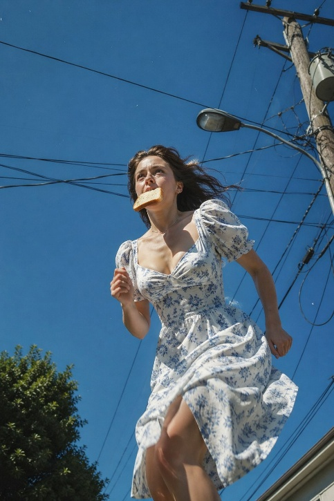</a></td>
<td align="center" width="25%"><a href="#02-create-a-polished-email">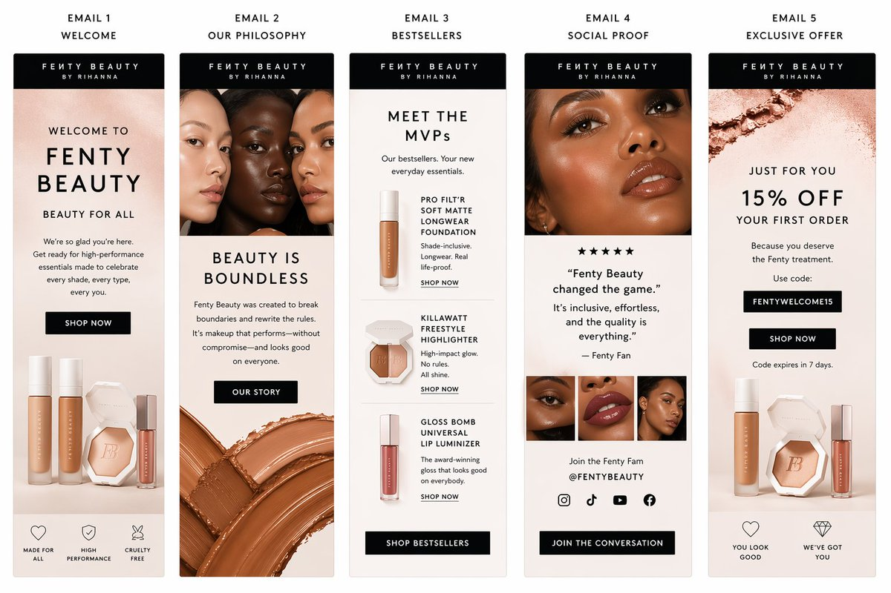</a></td>
<td align="center" width="25%"><a href="#03-please-create-an-infographic">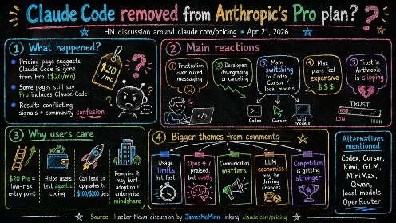</a></td>
<td align="center" width="25%"><a href="#04-d-chibi-style-miniature"></a></td>
</tr><tr>
<td align="center" width="25%"><a href="#05-please-create-a-vibrant">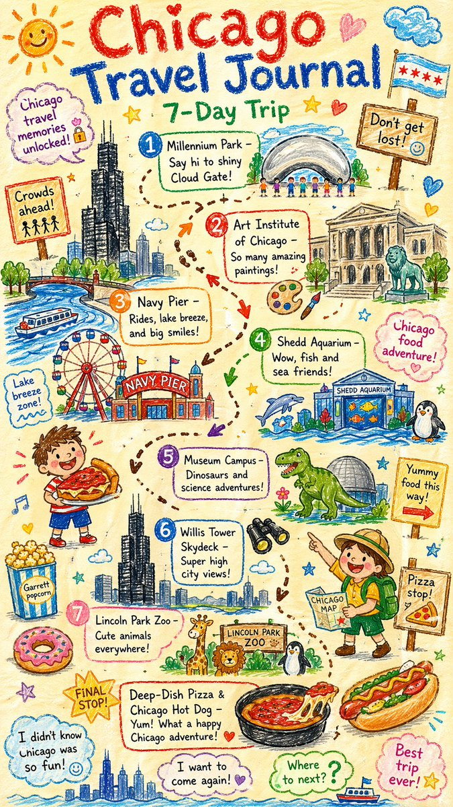</a></td>
<td align="center" width="25%"><a href="#06-an-ingame-screenshot-of">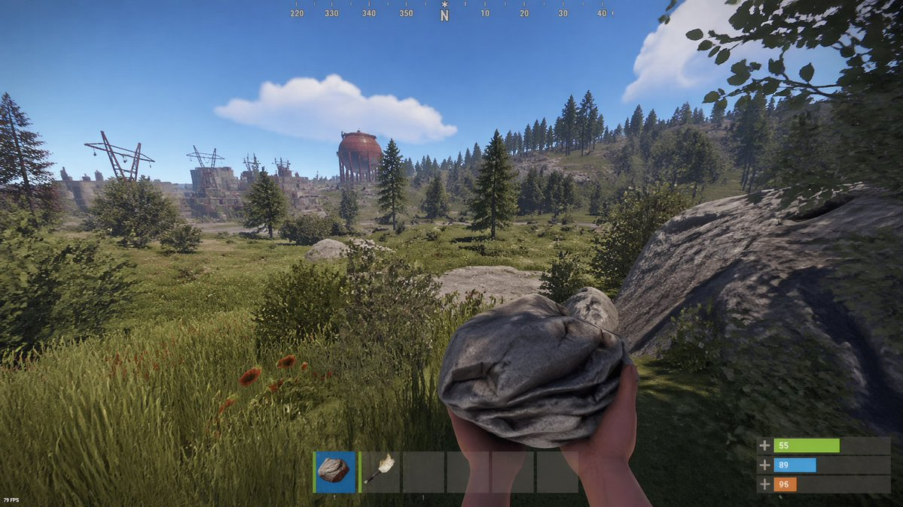</a></td>
<td align="center" width="25%"><a href="#07-meta-image-quality-very">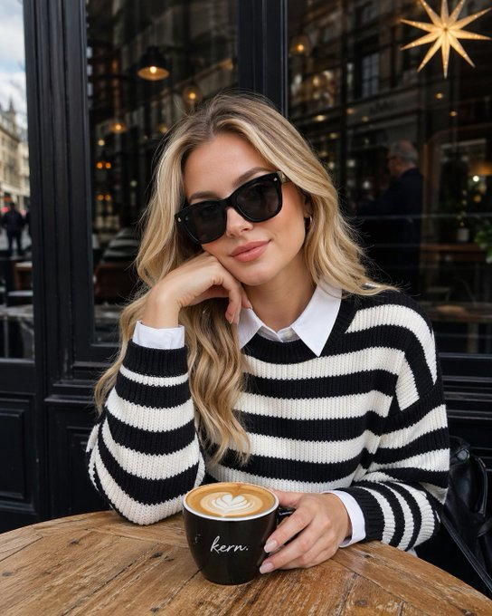</a></td>
<td align="center" width="25%"><a href="#08-a-traditional-chinese-ink">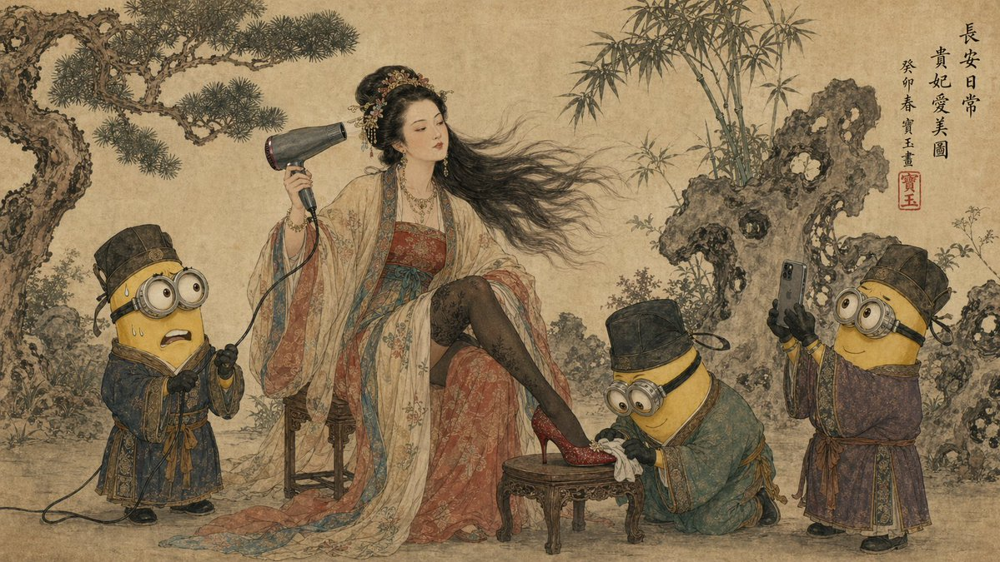</a></td>
</tr></table>

## Table of Contents

- [Portrait & Photography](#portrait--photography) · *9 prompts*
- [Poster & Editorial](#poster--editorial) · *9 prompts*
- [Infographic & Information Design](#infographic--information-design) · *22 prompts*
- [Social Media & Branding](#social-media--branding) · *9 prompts*
- [Comic & Illustration](#comic--illustration) · *5 prompts*
- [UI & Mockup](#ui--mockup) · *6 prompts*

## Portrait & Photography

### 01. A photorealistic capture of chaotic youth frozen in

*by [**Harshith**](https://t.co/5YHU5cCxMn)*

<a id="01-a-photorealistic-capture-of"></a>
<p align="center"><a href="images/01.jpg"></a></p>

<details>
<summary><b>Prompt</b> — Show full prompt</summary>

```text
A photorealistic capture of chaotic youth frozen in time, featuring a beautiful Russian woman running frantically with a slice of toast in her mouth. She is wearing a perfect, elegant dress that flows with her movement. The composition is a dramatic Low Angle worm's-eye view, emphasizing the vastness of the clear cobalt blue sky and the geometric framing of intersecting power lines above. The lighting simulates Hard Sunlight at noon, creating crisp, defined shadows on the subject. The image utilizes a Fujifilm Classic Negative aesthetic, adding a layer of nostalgic texture and high-fidelity realism.
```

</details>

[📖 View on Tosea](https://tosea.ai/prompts/gpt-image-2#01-a-photorealistic-capture-of)

---

### 07. 人物

*by [**Heisenberg**](https://t.co/XnASzxu1O1)*

<a id="07-meta-image-quality-very"></a>
<p align="center"><a href="images/07.jpg"></a></p>

<details>
<summary><b>Prompt</b> — Show full prompt</summary>

```text
{ "meta": { "image_quality": "Very High", "image_type": "Photo", "file_characteristics": { "compression_artifacts": "Low", "noise_level": "None", "lens_type_estimation": "Standard prime, approximately 35mm-50mm equivalent" } }, "global_context": { "scene_description": "A medium shot of a young woman with blonde hair sitting at an outdoor cafe table. She is resting her chin on her right hand, wearing dark oversized sunglasses and a black-and-white horizontally striped knit sweater over a white collared shirt. On the wooden table in front of her sits a black ceramic cup of coffee with latte art. Behind her is a dark-framed glass storefront reflecting the street and interior cafe lights. The atmosphere is urban, chic, and serene.", "environment_type": "Outdoor", "time_of_day": "Day", "weather_atmosphere": "Serene", "lighting": { "source": "Natural daylight with ambient interior reflections", "direction": "Front-left", "quality": "Soft/Diffused", "color_temperature": "Neutral (approx. 5500K)" }, "color_palette": { "dominant_hex_estimates": [ "#000000", "#FFFFFF", "#D2B48C", "#2B2B2B" ], "accent_colors": [ "#C19A6B", "#8B4513" ], "contrast_level": "High" } }, "composition": { "camera_angle": "Eye-level", "framing": "Medium shot", "depth_of_field": "Shallow", "focal_point": "The woman's face and sunglasses", "symmetry_type": "None", "rule_of_thirds_alignment": "Subject is centered; coffee cup aligns with the bottom horizontal third" }, "objects": [ { "id": "obj_001", "label": "Young Woman", "category": "Person", "location": { "relative_position": "Center", "bounding_box_percentage": { "x": 10.0, "y": 20.0, "width": 80.0, "height": 80.0 } }, "dimensions_relative": "Large", "distance_from_camera": "Near", "pose_orientation": "Facing forward, slight head tilt to her left, right hand under chin, left hand near coffee cup", "material": "Skin/Hair", "surface_properties": { "texture": "Smooth skin, wavy hair", "reflectivity": "Low", "micro_details": "Subtle makeup, peach-toned lipstick, manicured nails", "wear_state": "Pristine" }, "color_details": { "base_color_hex": "#F5D0C1", "secondary_colors": [ "#E5BE9E" ], "gradient_or_pattern": "Natural skin tones" }, "interaction_with_light": { "shadow_casting": "Soft shadow under chin and nose", "highlight_zones": "Forehead, bridge of nose, cheekbones", "translucency": "Low" }, "text_content": null, "relationships": [ { "type": "sitting_at", "target_object_id": "obj_005" }, { "type": "wearing", "target_object_id": "obj_002" }, { "type": "wearing", "target_object_id": "obj_003" } ] }, { "id": "obj_002", "label": "Striped Sweater", "category": "Clothing", "location": { "relative_position": "Center-bottom", "bounding_box_percentage": { "x": 8.0, "y": 45.0, "width": 75.0, "height": 45.0 } }, "dimensions_relative": "Large", "distance_from_camera": "Near", "pose_orientation": "Fitted to torso", "material": "Fabric/Knit", "surface_properties": { "texture": "Ribbed knit", "reflectivity": "None", "micro_details": "Horizontal black and white stripes, thick knit texture", "wear_state": "New" }, "color_details": { "base_color_hex": "#000000", "secondary_colors": [ "#FFFFFF" ], "gradient_or_pattern": "Even horizontal stripes" }, "interaction_with_light": { "shadow_casting": "Soft shadows in the knit grooves", "highlight_zones": "Shoulders", "translucency": "None" }, "relationships": [ { "type": "layered_over", "target_object_id": "obj_004" } ] }, { "id": "obj_003", "label": "Sunglasses", "category": "Accessory", "location": { "relative_position": "Center-top", "bounding_box_percentage": { "x": 37.0, "y": 30.0, "width": 25.0, "height": 10.0 } }, "dimensions_relative": "Small", "distance_from_camera": "Near", "pose_orientation": "Worn on face", "material": "Plastic/Acetate", "surface_properties": { "texture": "Smooth/Glossy", "reflectivity": "High", "micro_details": "Slight gold or silver hinge detail", "wear_state": "New" }, "color_details": { "base_color_hex": "#1A1A1A", "secondary_colors": [], "gradient_or_pattern": "Solid" }, "interaction_with_light": { "shadow_casting": "Small shadow on bridge of nose", "highlight_zones": "Upper edges of frames", "translucency": "None" } }, { "id": "obj_004", "label": "White Collared Shirt", "category": "Clothing", "location": { "relative_position": "Center-neckline", "bounding_box_percentage": { "x": 48.0, "y": 50.0, "width": 10.0, "height": 5.0 } }, "dimensions_relative": "Small", "distance_from_camera": "Near", "pose_orientation": "Under sweater", "material": "Cotton/Fabric", "surface_properties": { "texture": "Smooth", "reflectivity": "None", "micro_details": "Sharp pointed collar", "wear_state": "Pristine" }, "color_details": { "base_color_hex": "#FFFFFF", "secondary_colors": [], "gradient_or_pattern": "Solid" } }, { "id": "obj_005", "label": "Wooden Table", "category": "Furniture", "location": { "relative_position": "Bottom-center", "bounding_box_percentage": { "x": 30.0, "y": 85.0, "width": 50.0, "height": 15.0 } }, "dimensions_relative": "Medium", "distance_from_camera": "Near", "pose_orientation": "Horizontal plane", "material": "Wood", "surface_properties": { "texture": "Grainy", "reflectivity": "Low", "micro_details": "Natural wood grain lines", "wear_state": "Used" }, "color_details": { "base_color_hex": "#D2B48C", "secondary_colors": [ "#8B4513" ], "gradient_or_pattern": "Wood grain" } }, { "id": "obj_006", "label": "Coffee Cup", "category": "Kitchenware", "location": { "relative_position": "Bottom-center", "bounding_box_percentage": { "x": 31.0, "y": 85.0, "width": 18.0, "height": 15.0 } }, "dimensions_relative": "Small", "distance_from_camera": "Near", "pose_orientation": "Upright", "material": "Ceramic", "surface_properties": { "texture": "Matte/Smooth", "reflectivity": "Low", "micro_details": "White foam art on top of liquid", "wear_state": "Clean" }, "color_details": { "base_color_hex": "#000000", "secondary_colors": [ "#C19A6B", "#FFFFFF" ], "gradient_or_pattern": "Solid exterior with foam pattern inside" }, "text_content": { "raw_text": "kern.", "font_style": "Cursive/Handwritten", "font_weight": "Regular", "text_case": "Lowercase", "alignment": "Center", "color_hex": "#FFFFFF" }, "relationships": [ { "type": "resting_on", "target_object_id": "obj_005" } ] }, { "id": "obj_007", "label": "Cafe Window", "category": "Structure", "location": { "relative_position": "Background", "bounding_box_percentage": { "x": 0.0, "y": 0.0, "width": 100.0, "height": 80.0 } }, "dimensions_relative": "Large", "distance_from_camera": "Mid", "pose_orientation": "Vertical", "material": "Glass/Metal", "surface_properties": { "texture": "Smooth/Reflective", "reflectivity": "High", "micro_details": "Black metal frames, star-shaped light decoration in top right, reflected street lights", "wear_state": "Clean" }, "color_details": { "base_color_hex": "#000000", "secondary_colors": [ "#2F2F2F" ], "gradient_or_pattern": "Complex reflections" } } ], "background_details": { "texture": "Reflective glass and dark metal frame", "patterns": "Reflected bokeh lights and architectural lines", "lighting_behavior": "Specular highlights from interior lights and sky", "additional_elements": [ "Star-shaped decorative light", "Reflected human figures", "Warm interior glow" ] }, "foreground_elements": { "particles": "None", "artifacts": "Slight bokeh in the background reflections" }, "reconstruction_notes": { "mandatory_elements_for_recreation": "Black and white horizontal striped sweater, oversized black sunglasses, blonde wavy hair, coffee cup with 'kern.' logo, outdoor cafe setting", "sensitivity_factors": "The contrast between the black and white stripes and the warm wood of the table; the specific cursive typography on the cup", "ambiguities": "The exact contents of the reflection in the window; the specific brand of the sunglasses" } }
```

</details>

[📖 View on Tosea](https://tosea.ai/prompts/gpt-image-2#07-meta-image-quality-very)

---

### 08. A traditional Chinese ink and color painting in Gongbi style on…

*by [**宝玉**](https://t.co/9LMAC9R2Rv)*

<a id="08-a-traditional-chinese-ink"></a>
<p align="center"><a href="images/08.jpg"></a></p>

<details>
<summary><b>Prompt</b> — Show full prompt</summary>

```text
A traditional Chinese ink and color painting in Gongbi style on aged rice paper texture. A noblewoman in elaborate Tang Dynasty Hanfu robes sits on a wooden stool, holding a modern hairdryer to dry her long flowing hair. She is wearing black stockings, red high heels on one foot, resting on a small stool. Three 小黄人 dressed in ancient Chinese servant robes and hats attend to her: one on the left looks stressed holding the hairdryer's power cord, one center kneels polishing her red shoe with a cloth, and one on the right holds up a smartphone taking a photo for her. The background features classical gnarled pine trees, bamboo groves, and Taihu rocks. Traditional Chinese calligraphy written in the top right corner, accompanied by a red artist chop seal (寶玉). The color palette is muted mineral pigments. Humorous, anachronistic fusion. --ar 16:9
```

</details>

[📖 View on Tosea](https://tosea.ai/prompts/gpt-image-2#08-a-traditional-chinese-ink)

---

### 10. Professional studio fashion photography, ultra-clean high-end d…

*by [**BubbleBrain**](https://t.co/JfSKdoNAMo)*

<a id="10-professional-studio-fashion-photography"></a>
<p align="center"><a href="images/10.jpg"></a></p>

<details>
<summary><b>Prompt</b> — Show full prompt</summary>

```text
Professional studio fashion photography, ultra-clean high-end digital editorial portrait in a pure white seamless cyclorama photography studio, massive soft octabox key light + large softbox fill light creating flawless even illumination with gentle sculpting shadows, Vogue-level minimalist high fashion aesthetic, eye-level shot, 3/4 body shot, early 20s Korean idol-type young woman with ultra-realistic delicate refined Korean features, slightly upturned almond-shaped fox eyes with natural double eyelids, small sharp jawline, flawless yet realistic porcelain skin with cool ivory undertone, completely natural post-workout no-makeup look, soft natural flush on cheeks, subtle dewy skin glow from light sweat, natural dusty rose lips slightly parted, subtle natural freckles across nose and cheeks, visible subtle skin texture, pores and micro skin details, long naturally wavy dark brown hair slightly messy with realistic loose strands, wearing a white fitted tennis polo or short-sleeve athletic top and a high-waisted white tennis skirt, standing naturally in the center of the pure white studio, holding a white tennis racket casually resting on one shoulder, the other hand relaxed at her side or lightly on her hip, one leg slightly forward, posture natural and confident, looking directly at the viewer at eye level with a calm, confident and fresh expression, pure soft professional studio lighting with large diffused sources, flawless even illumination, gentle sculpting shadows that naturally define the figure, clean high-key minimalist aesthetic, ultra-clean high-end digital photography, extremely sharp yet soft skin rendering with natural dewy glow, no film grain, no noise, no halation, no vignette, perfect neutral color grading, authentic Korean idol studio editorial aesthetic, visible realistic tennis racket texture, natural skin texture with freckles and subtle sweat sheen, no plastic skin, no digital over-sharpening, no airbrushing, no watermark, no text --ar 9:16
```

</details>

[📖 View on Tosea](https://tosea.ai/prompts/gpt-image-2#10-professional-studio-fashion-photography)

---

### 14. 黑神话 钟馗

*by [**苏打白.Dev**](https://t.co/zUFRPc7DKu)*

<a id="prompt-14"></a>
<p align="center"><a href="images/14.jpg">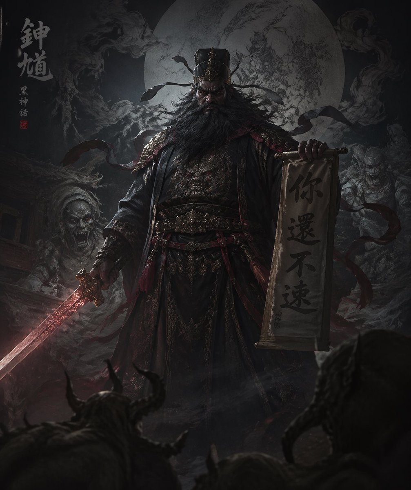</a></p>

<details>
<summary><b>Prompt</b> — Show full prompt</summary>

```text
黑神话 钟馗
```

</details>

[📖 View on Tosea](https://tosea.ai/prompts/gpt-image-2#prompt-14)

---

### 26. long-sleeve fitted V-neck dress or top

*by [**Kate Deyneka**](https://t.co/8ZzTjItjtM)*

<a id="26-meta-quality-ultra-photorealistic"></a>
<p align="center"><a href="images/26.jpg">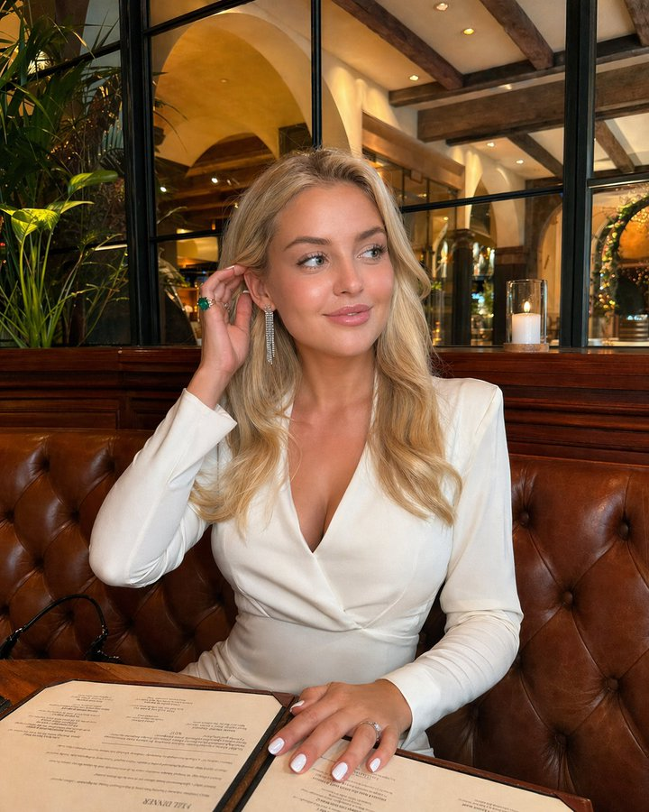</a></p>

<details>
<summary><b>Prompt</b> — Show full prompt</summary>

```text
{ "meta": { "quality": "ultra photorealistic", "resolution": "8k", "camera": "iPhone 15 Pro", "lens": "24mm wide", "aspect_ratio": "4:5", "style": "natural restaurant portrait, warm ambient lighting, candid luxury lifestyle, shallow depth of field" }, "character_lock": { "age": "mid-late 20s (clearly adult)", "gender_presentation": "feminine", "skin_tone": "fair", "hair": { "color": "light blonde", "style": "soft loose waves, side-parted, polished but natural volume" }, "eyes": "light blue-gray", "face": { "shape": "oval", "features": "soft refined features, delicate nose, subtle cheek definition", "skin": "smooth natural complexion with soft glow" }, "body": { "type": "slim", "framing": "upper body seated portrait" } }, "scene": { "location": "upscale restaurant booth", "time": "late afternoon / early evening", "atmosphere": "warm, elegant, intimate, cozy" }, "camera_perspective": { "pov": "seated across the table from the subject", "camera_mode": "standard iPhone photo", "distance": "about 1-1.5 meters away", "angle": "straight-on slightly above table level", "framing": "vertical portrait, subject centered slightly right, menu visible in foreground", "focus": "sharp focus on subject, softly blurred background", "depth": "natural shallow depth of field" }, "subject": { "action": "sitting in a restaurant booth, lightly touching her hair near one ear, looking off to the side", "pose": { "position": "seated upright in a brown leather booth", "posture": "elegant, relaxed, poised", "left_hand": "resting on the table near the menu", "right_hand": "raised near ear, adjusting hair or earpiece", "head": { "tilt": "slight turn to the right", "gaze": "looking away from camera, thoughtful and soft" }, "expression": "gentle closed-mouth smile, calm and confident" }, "outfit": { "dress": { "type": "long-sleeve fitted V-neck dress or top", "color": "ivory / cream white", "fit": "sleek, tailored, elegant", "fabric": "smooth satin-like or stretch silk finish" }, "jewelry": { "earrings": "long dangling rhinestone earrings", "rings": "statement rings on right hand", "additional": "subtle elegant accessories" }, "other_details": [ "white manicure", "large green statement ring" ] }, "hair_makeup": { "hair": "soft blonde waves with smooth blowout finish", "makeup": "natural glam, luminous skin, defined lashes, soft pink-nude lips" } }, "environment": { "interior_details": [ "brown tufted leather booth seating", "wooden table and wood paneling", "large black metal-framed glass partition behind subject", "high ceiling with exposed wooden beams", "arched architectural details", "warm recessed ceiling lights", "candle on the ledge behind the subject", "plants on the left side of frame", "restaurant menu open in foreground" ], "lighting": { "type": "warm natural indoor ambient light mixed with soft architectural lighting", "effect": "gentle flattering glow on skin, cozy upscale dining mood", "shadows": "soft natural shadows, no harsh contrast" }, "background": { "clarity": "softly blurred but still recognizable restaurant interior", "elements": "glass partition, candle, arches, wood beams, plants" } }, "vibe": { "mood": "elegant, feminine, refined, quietly luxurious", "energy": "soft confidence, date-night chic, polished lifestyle content", "content": "candid upscale restaurant portrait" }, "photography_rules": { "composition": { "foreground_interest": "menu visible at bottom of frame adds realism and context", "subject_priority": "subject is the clear focal point", "balance": "restaurant architecture frames the subject symmetrically" }, "camera_specs": { "mode": "standard iPhone portrait-style capture", "focus": "face and upper body sharp", "exposure": "balanced for warm indoor restaurant lighting" }, "authenticity": { "natural_skin_texture": true, "realistic_lighting": true, "no_heavy_post_processing": true, "candid_luxury_feel": true }, "realism": { "skin": "natural texture, soft highlights", "lighting": "true warm indoor light behavior", "colors": "rich wood tones, cream fabric, warm golden ambience", "sharpness": "crisp subject with natural background falloff" } } }
```

</details>

[📖 View on Tosea](https://tosea.ai/prompts/gpt-image-2#26-meta-quality-ultra-photorealistic)

---

### 29. real human female face

*by [**Muhammad Ayan**](https://t.co/1oaXpSoBic)*

<a id="29-prompt-type-hyper-realistic"></a>
<p align="center"><a href="images/29.jpg">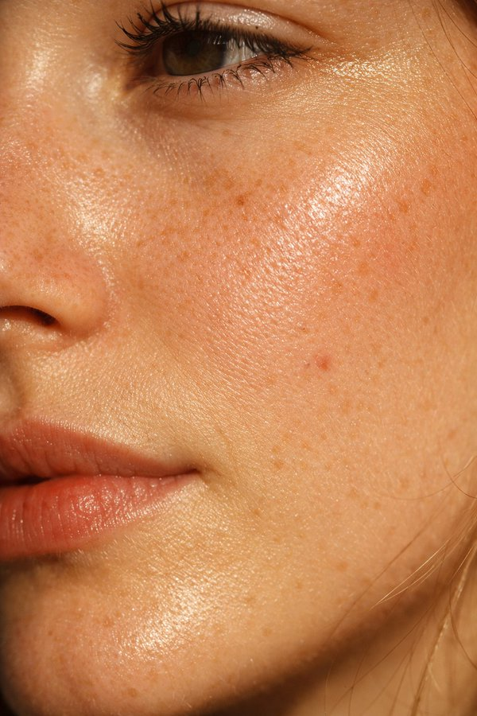</a></p>

<details>
<summary><b>Prompt</b> — Show full prompt</summary>

```text
{ "prompt_type": "hyper_realistic_image_generation", "version": "3.1", "generation_intent": "Produce a clinically accurate extreme macro close-up of a real female face with white glowing sun-kissed skin — indistinguishable from a DSLR macro photograph. Zero retouching. Zero beautification. Raw luminous feminine skin realism only.", "main_prompt": { "subject": { "type": "real human female face", "age_range": "early to mid 20s", "skin_type": "fair to light — naturally glowing, sun-kissed luminosity", "skin_tone": "white porcelain base with warm golden sun-kissed overlay — like skin that has caught natural sunlight over time", "skin_glow": "inner luminosity — skin appears lit from within, not from product", "makeup": "completely bare — no foundation, no concealer, no mascara", "expression": "neutral and relaxed — unaware of the camera", "ethnicity": "fair-skinned — naturally light complexion with warm golden sun exposure" }, "composition": { "shot_type": "extreme macro close-up", "aspect_ratio": "9:16 — vertical portrait format", "framing": "from just below the eye line to just above the upper lip — cheek and nose as primary region", "angle": "slight three-quarter angle — not fully frontal", "background": "deep black or very dark neutral — maximum contrast to make white glowing skin luminance pop", "negative_space": "minimal — glowing skin fills 90 percent of the frame" }, "skin_tone_and_glow": { "base_color": "bright fair white — clean porcelain undertone", "sun_kiss_layer": [ "warm golden honey tone sitting on top of the white base — as if kissed by natural sunlight", "sun-kissed warmth concentrated on the cheekbone, nose bridge, and forehead", "slightly deeper warm tone near the hairline and jaw edges", "natural uneven sun exposure — not uniform, not fake tan" ], "glow_character": [ "skin appears naturally luminous — lit from within", "soft diffused radiance across the cheekbone highlight zone", "micro specular highlights on raised skin polygons catching light", "healthy subcutaneous warmth visible just beneath the skin surface", "glow is biological — not product shimmer, not highlighter" ], "freckles": [ "light natural sun freckles scattered across the nose bridge and upper cheeks", "freckles are faint and pale golden-brown — not heavy", "random natural placement — no symmetry" ] }, "skin_texture_requirements": { "priority": "CRITICAL — every pore must be individually rendered even on glowing skin", "pore_details": [ "open pores of varying sizes visible across the cheek — larger near the nose, finer toward the cheekbone", "pores remain visible beneath the skin glow — glow does not erase texture", "micro-ridges and valleys forming a natural skin polygon mesh", "uneven pore distribution — completely random, never pattern-repeated" ], "hair_details": [ "fine golden vellus hairs catching warm light across the cheekbone", "peach fuzz glowing slightly at the edges where light catches it", "no stubble — smooth female skin with only delicate illuminated vellus hairs" ], "skin_surface": [ "natural luminous dewiness — soft radiant sheen without oiliness", "light refracts softly across the skin surface — not mirror-like", "realistic skin translucency — golden warmth glowing beneath the surface" ] }, "skin_imperfections": { "blemishes": [ "1 to 2 faint natural blemishes or tiny dark spots — imperfections remain despite the glow", "faint sun freckles doubling as natural marks across the nose and cheeks", "barely visible fine skin lines — completely natural" ], "tone_variation": [ "slightly deeper warm golden tone around the nostril crease", "pinkish warmth near the cheekbone from subcutaneous vessels", "white base breaking through in the under-eye and jaw area — natural uneven sun distribution" ] }, "eye_and_lash_details": { "lashes": "lower lashes partially visible at top of frame — individually defined, naturally light to medium brown, no mascara", "skin_around_eye": "delicate glowing under-eye skin — fine texture visible, softly luminous, zero retouching" }, "lighting": { "type": "warm single source natural light — golden hour or bright window", "direction": "upper left — approximately 10 to 11 o clock position", "angle_to_skin": "shallow grazing — 15 to 25 degrees to reveal texture while enhancing glow", "color_temperature": "warm — 5000K to 6000K with slight golden cast", "purpose": "amplify the natural skin luminosity and sun-kissed warmth while still revealing pore texture and vellus hair detail", "highlight_behavior": "soft golden specular on the cheekbone and nose tip — not blown out", "shadow_behavior": "gentle warm shadows falling into pores — shadow retains warmth, not cold or blue", "forbidden": [ "no cold blue light", "no ring lights", "no studio beauty lighting", "no fill lights that flatten texture or kill the glow" ] }, "color_processing": { "skin_base": "bright white porcelain with warm golden sun-kissed overlay", "white_balance": "slightly warm — 5800K to 6200K — golden hour feel", "contrast": "medium soft — preserves glow without flattening texture", "highlights": "controlled luminous — skin glows but highlight detail is never blown", "shadows": "warm — shadow tones lean golden-amber, not grey or cold", "saturation": "natural warm — golden tones slightly lifted, reds near nose gently restrained", "overall_grade": "sun-drenched warmth — like golden afternoon light on white skin" }, "technical_photo_specs": { "lens": "100mm macro equivalent", "aperture": "f/2.8 — ultra-shallow depth of field", "aspect_ratio": "9:16 vertical — full portrait orientation", "focus_point": "cheek skin surface — tack sharp on skin texture and pores", "sensor_simulation": "full-frame DSLR — Sony A7R IV or Canon R5 equivalent", "grain": "very subtle natural sensor noise — adds authenticity", "sharpness": "natural micro-contrast — no over-sharpening halos" }, "style": { "realism_level": "100 percent photorealistic — real DSLR macro photograph standard", "post_processing": "zero retouching — the glow is biological not digital", "aesthetic": "raw sun-kissed documentary realism — luminous because she is real, not because she is edited", "mood": "warm, natural, radiant — summer skin in its most honest form" } }, "negative_prompts": [ "no airbrushed or smoothed skin", "no plastic or porcelain doll appearance", "no pore erasure even on glowing skin", "no artificial highlighter or shimmer product", "no fake tan or spray tan orange tone", "no beauty retouching", "no cold or blue-toned lighting", "no symmetry correction", "no AI synthetic gloss", "no flat uniform skin color", "no CGI render appearance", "no makeup of any kind", "no over-sharpening halos", "no blown-out highlights — glow must stay controlled" ], "quality_checkpoints": { "glow_test": "Does the skin appear naturally luminous and sun-kissed — not from product but from biology? If yes — pass.", "pore_test": "Are individual pores still visible beneath the glow across the cheek? If yes — pass.", "freckle_test": "Are light natural sun freckles present on the nose bridge and cheeks? If yes — pass.", "warmth_test": "Does the overall image feel warm and golden — not cold or clinical? If yes — pass.", "realism_test": "Would a viewer believe this is a real photograph of a real woman? If yes — pass.", "retouching_test": "Is there zero evidence of digital skin smoothing or artificial glow effects? If yes — pass." }, "metadata": { "use_case": "hyper_realistic_female_glowing_sunkissed_skin_macro_portrait", "aspect_ratio": "9:16", "target_output": "unretouched bare glowing sun-kissed white skin extreme macro female portrait", "intended_platforms": ["Midjourney v6", "DALL-E 3", "Stable Diffusion XL", "Leonardo AI"], "priority_keywords": [ "white glowing skin macro", "sun-kissed female portrait", "bare luminous skin", "natural skin glow", "golden hour skin realism", "freckled sun-kissed close-up", "unretouched radiant female skin", "9:16 vertical macro portrait" ] } }
```

</details>

[📖 View on Tosea](https://tosea.ai/prompts/gpt-image-2#29-prompt-type-hyper-realistic)

---

### 38. Reframe this image to show the behind the scenes.

*by [**A.I.Warper**](https://t.co/STYPuT94Hn)*

<a id="38-reframe-this-image-to"></a>
<p align="center"><a href="images/38.jpg">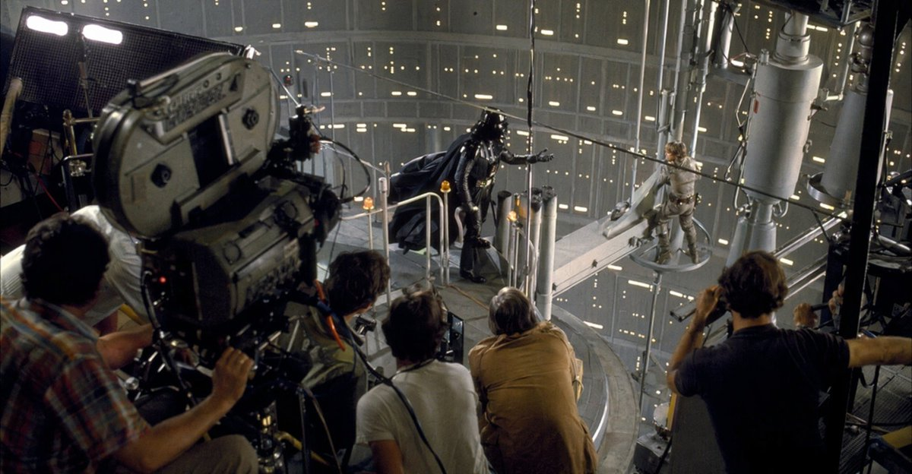</a></p>

<details>
<summary><b>Prompt</b> — Show full prompt</summary>

```text
reframe this image to show the behind the scenes. A photo taken from a third party behind the directory as the scene plays out
```

</details>

[📖 View on Tosea](https://tosea.ai/prompts/gpt-image-2#38-reframe-this-image-to)

---

### 42. A photo of a computer screen displaying a Spotify playlist at n…

*by [**Pietro Schirano**](https://t.co/Rbq4WTM0kc)*

<a id="42-a-photo-of-a"></a>
<p align="center"><a href="images/42.jpg">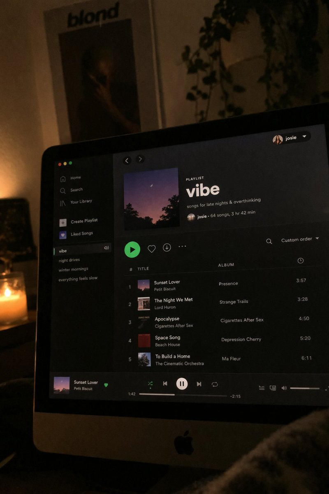</a></p>

<details>
<summary><b>Prompt</b> — Show full prompt</summary>

```text
A photo of a computer screen displaying a Spotify playlist at night
```

</details>

[📖 View on Tosea](https://tosea.ai/prompts/gpt-image-2#42-a-photo-of-a)

---

## Poster & Editorial

### 09. A striking Spring 2026 city poster for Boston

*by [**BubbleBrain**](https://t.co/ZCjJjikIeT)*

<a id="09-a-striking-spring-city"></a>
<p align="center"><a href="images/09.jpg"></a></p>

<details>
<summary><b>Prompt</b> — Show full prompt</summary>

```text
A striking Spring 2026 city poster for Boston with an elegant celebratory mood and a bold contemporary design. On a clean off-white textured background with large areas of negative space, a miniature single sculler rows across the lower right corner of the image on a narrow ribbon of reflective water. The wake from the oar sweeps upward in a dynamic calligraphic curve, gradually transforming into the Charles River and then into a dreamlike hand-painted panorama of Boston. Inside this flowing river-shaped composition are iconic Boston elements: the Back Bay skyline, Beacon Hill brownstones, Acorn Street, Boston Public Garden, Swan Boats, Zakim Bridge, Fenway-inspired details, historic brick architecture, harbor ferries, and the city’s waterfront atmosphere. Soft morning fog, golden spring light, subtle festive accents in crimson and gold, rich detail, layered depth, sophisticated city-poster aesthetics, fresh and refined, visually powerful but not overcrowded. Elegant typography in the lower left reads “SPRING 2026” with a vertical slogan “BOSTON, A CITY OF RIVER, MEMORY, AND INVENTION”, text clear and beautifully composed, premium graphic design, 9:16
```

</details>

[📖 View on Tosea](https://tosea.ai/prompts/gpt-image-2#09-a-striking-spring-city)

---

### 16. A premium, hand-crafted illustrated recipe poster titled “CLASS…

*by [**Ai Girllie**](https://t.co/S9ch8JM6Vk)*

<a id="16-a-premium-hand-crafted"></a>
<p align="center"><a href="images/16.jpg">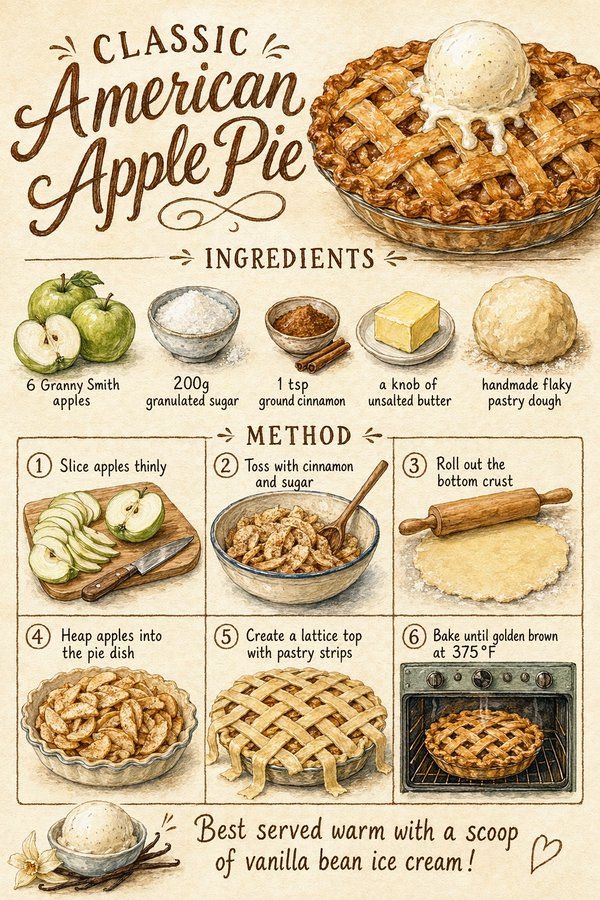</a></p>

<details>
<summary><b>Prompt</b> — Show full prompt</summary>

```text
A premium, hand-crafted illustrated recipe poster titled “CLASSIC AMERICAN APPLE PIE” in elegant, flowing cinnamon-brown calligraphy at the top. The background features a warm, textured watercolor paper with subtle grain and soft beige tones, giving a cozy, vintage kitchen feel. At the top-right, a beautifully detailed, hand-drawn apple pie with a perfectly golden lattice crust sits slightly angled, with a scoop of melting vanilla bean ice cream gently cascading over the edge. Soft shadows and delicate highlights add depth and realism, with visible watercolor brush strokes and ink outlines. Below the title, an “INGREDIENTS” section is neatly arranged with charming, minimal hand-drawn icons and clean handwritten labels: • 6 Granny Smith apples (illustrated as a small pile of fresh green apples) • 200g granulated sugar (tiny bowl with sugar crystals) • 1 tsp ground cinnamon (small spoon with warm brown spice) • A knob of unsalted butter (soft butter cube sketch) • Handmade flaky pastry dough (rolled dough with a wooden pin) Each ingredient is spaced evenly with a balanced, aesthetic layout. The lower half features a structured “METHOD” section in a 2x3 illustrated grid, each step inside a soft-bordered square with light watercolor accents: 1- Slice apples thinly 2- Toss with cinnamon and sugar 3- Roll out the bottom crust 4- Fill pie dish with apples 5- Weave a lattice pastry top 6- Bake until golden at 375°F Each step includes a small, expressive illustration with consistent line art and soft color washes. At the bottom, a handwritten note reads: “Best served warm with a scoop of vanilla bean ice cream!”
```

</details>

[📖 View on Tosea](https://tosea.ai/prompts/gpt-image-2#16-a-premium-hand-crafted)

---

### 22. Create a poster for a fictional anime movie using GPT image2.

*by [**SEIIIRU😈動画生成AIを使う映像クリエイター**](https://t.co/YX0ScJWk55)*

<a id="22-create-a-poster-for"></a>
<p align="center"><a href="images/22.jpg"></a></p>

<details>
<summary><b>Prompt</b> — Show full prompt</summary>

```text
Create a poster for a fictional anime movie using GPT image2.
```

</details>

[📖 View on Tosea](https://tosea.ai/prompts/gpt-image-2#22-create-a-poster-for)

---

### 34. Create a visually stunning educational infographic explaining M…

*by [**1LittleCoder💻**](https://t.co/Kn4hZoP7iR)*

<a id="34-create-a-visually-stunning"></a>
<p align="center"><a href="images/34.jpg">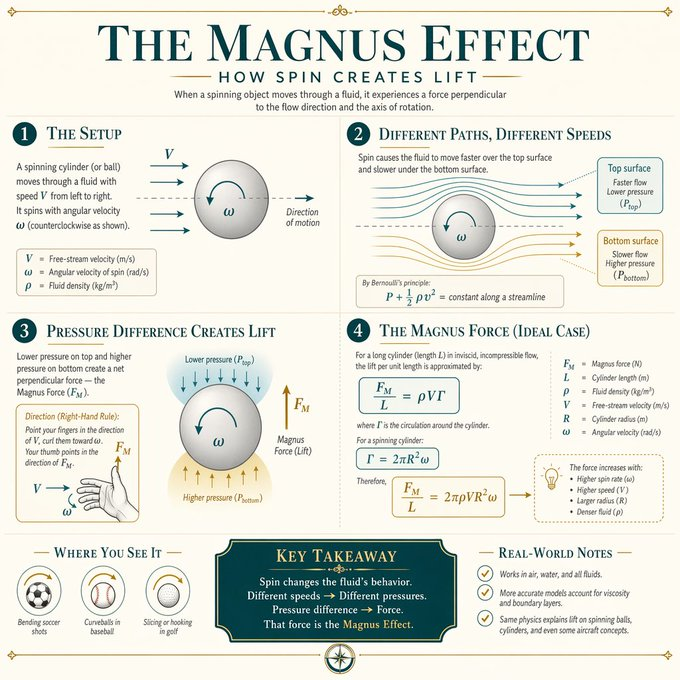</a></p>

<details>
<summary><b>Prompt</b> — Show full prompt</summary>

```text
Create a visually stunning educational infographic explaining Magnus Effect in a clean, modern academic style. Use a soft neutral background (cream or light beige), elegant serif typography for titles, and minimalist sans-serif for body text. Structure the layout into clearly separated numbered sections (e.g., 1, 2, 3, 4), each with a concise heading and short explanation. Include subtle dividing lines and balanced spacing. Incorporate mathematical notation, symbols, and step-by-step visual diagrams (like grids, arrows, highlights, or boxed elements) to illustrate the concept clearly. Use a limited color palette (teal, gold accents, dark gray text) with soft highlights for emphasis. Add visual cues like arrows, dotted lines, or highlighted boxes to guide the viewer’s eye through the logic. Maintain symmetry, alignment, and a polished “textbook meets modern design” aesthetic. The final design should feel like a premium educational poster - minimal, elegant, highly readable, and intellectually satisfying.
```

</details>

[📖 View on Tosea](https://tosea.ai/prompts/gpt-image-2#34-create-a-visually-stunning)

---

### 37. Create a Science fiction movie poster

*by [**underwood**](https://t.co/RYeICaD6L0)*

<a id="37-create-a-science-fiction"></a>
<p align="center"><a href="images/37.jpg"></a></p>

<details>
<summary><b>Prompt</b> — Show full prompt</summary>

```text
Create a Science fiction movie poster
```

</details>

[📖 View on Tosea](https://tosea.ai/prompts/gpt-image-2#37-create-a-science-fiction)

---

### 43. ・Refer to 1 character image ・Poster for the fictional cartoon a…

*by [**🗯️RelaxBeatsLab™︎**](https://t.co/TkQ5dvBAZg)*

<a id="43-refer-to-character-image"></a>
<p align="center"><a href="images/43.jpg">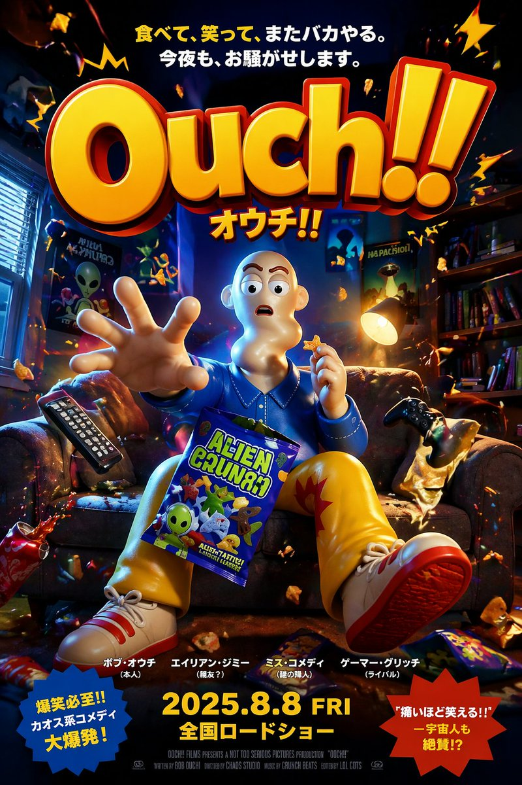</a></p>

<details>
<summary><b>Prompt</b> — Show full prompt</summary>

```text
・Refer to 1 character image ・Poster for the fictional cartoon anime "Ouch!!
```

</details>

[📖 View on Tosea](https://tosea.ai/prompts/gpt-image-2#43-refer-to-character-image)

---

### 51. 1960s French New Wave theatrical poster, bold photomontage

*by [**宝玉**](https://t.co/chr7nNcHNS)*

<a id="51-s-french-new-wave"></a>
<p align="center"><a href="images/51.jpg"></a></p>

<details>
<summary><b>Prompt</b> — Show full prompt</summary>

```text
1960s French New Wave theatrical poster, bold photomontage composition, torn-paper collage sensibility, pop-art color bursts, high-contrast black-and-white imagery with selective red blue and yellow accents, hand-made offset-print texture, slightly off-register ink, expressive asymmetry, art-house poster cool, graphic spontaneity, street-poster energy, adventurous typography-led design. Poster text: - Large title at the bottom: "GPT Image 2.0" - Smaller headline at the top: "Image generation with a point of view" - Small footer text: "Coming soon" Keep all visible text in English. Use a theatrical poster composition.
```

</details>

[📖 View on Tosea](https://tosea.ai/prompts/gpt-image-2#51-s-french-new-wave)

---

### 58. Post-apocalyptic ruin, but like a luxury real estate brochure

*by [**Kazım Taşkın**](https://t.co/Xtri6P1U7b)*

<a id="58-post-apocalyptic-ruin-but"></a>
<p align="center"><a href="images/58.jpg">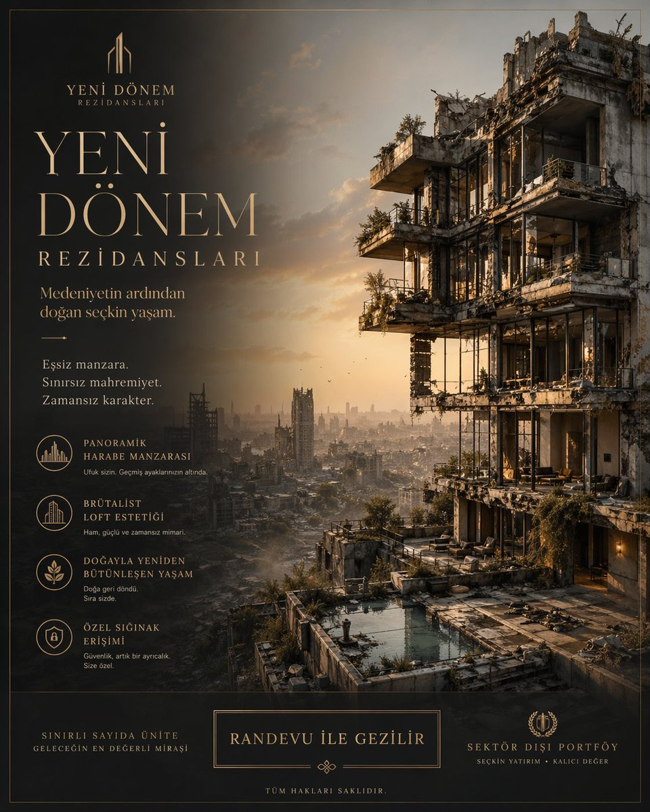</a></p>

<details>
<summary><b>Prompt</b> — Show full prompt</summary>

```text
Post-apocalyptic ruin, but like a luxury real estate brochure
```

</details>

[📖 View on Tosea](https://tosea.ai/prompts/gpt-image-2#58-post-apocalyptic-ruin-but)

---

### 60. A refined 2026 New York City promotional poster with a bold yet…

*by [**Hermes Changelog**](https://t.co/Ed5Dike2Tm)*

<a id="60-a-refined-new-york"></a>
<p align="center"><a href="images/60.jpg">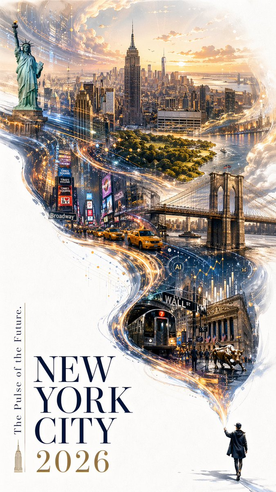</a></p>

<details>
<summary><b>Prompt</b> — Show full prompt</summary>

```text
A refined 2026 New York City promotional poster with a bold yet elegant metropolitan atmosphere. Double exposure composition, maintaining an S-shaped sense of dynamic flow. On a clean white textured background, in the lower-right corner, a miniature figure dressed in modern urban fashion releases a long ribbon of glowing amber and midnight-blue light. The ribbon moves fluidly like silk, gradually transforming as it flows toward the upper-left into a majestic cityscape of skyscrapers, bridges, rivers, and luminous data streams. Within this flowing “river of light,” overlay a hand-drawn panoramic map of New York City, blending finance, culture, history, and cutting-edge innovation. The scene feels energetic, iconic, layered, and globally influential. Include signature NYC elements: Statue of Liberty, Empire State Building, Central Park, Brooklyn Bridge, Wall Street, Times Square neon lights, Manhattan skyline, subway lines, yellow taxis, Hudson River reflections, Broadway theaters, and subtle fintech + AI-inspired digital patterns woven into the architecture. Surrounded by soft atmospheric haze, golden sunset light reflecting on glass towers, drifting clouds, and fine digital particles. Rich yet balanced colors, intricate composition, highly detailed, grand and cinematic, while preserving minimal elegance through generous white space. In the lower-left corner, elegant typography reads “NEW YORK CITY 2026” with a vertical promotional slogan: “The Pulse of the Future.” Premium editorial layout, refined spacing, crisp typography, luxury city branding poster, cinematic lighting, sophisticated detail, 9:16 aspect ratio.
```

</details>

[📖 View on Tosea](https://tosea.ai/prompts/gpt-image-2#60-a-refined-new-york)

---

## Infographic & Information Design

### 03. Please create an infographic based on the input

*by [**宝玉**](https://t.co/XpBQ4DQrUp)*

<a id="03-please-create-an-infographic"></a>
<p align="center"><a href="images/03.jpg"></a></p>

<details>
<summary><b>Prompt</b> — Show full prompt</summary>

```text
Please create an infographic based on the input content, highlighting key themes and essential points: - Simplify information, emphasizing keywords and core concepts, leaving ample whitespace for clarity. - Include minimalistic cartoon elements, icons, or simple portraits of famous figures to enhance engagement and visual recall. - All text and images should strictly use colored chalk style without realistic illustrations. - Unless specifically requested, maintain the original language of the input content. - Use a horizontal layout (16:9) with a black chalkboard background and colorful chalk drawing style. Please create the illustration based on the input provided.
```

</details>

[📖 View on Tosea](https://tosea.ai/prompts/gpt-image-2#03-please-create-an-infographic)

---

### 11. Create step-by-step recipe infographic for creamy garlic mushro…

*by [**Ege**](https://t.co/eo7Qm21XD0)*

<a id="11-create-step-by-step"></a>
<p align="center"><a href="images/11.jpg">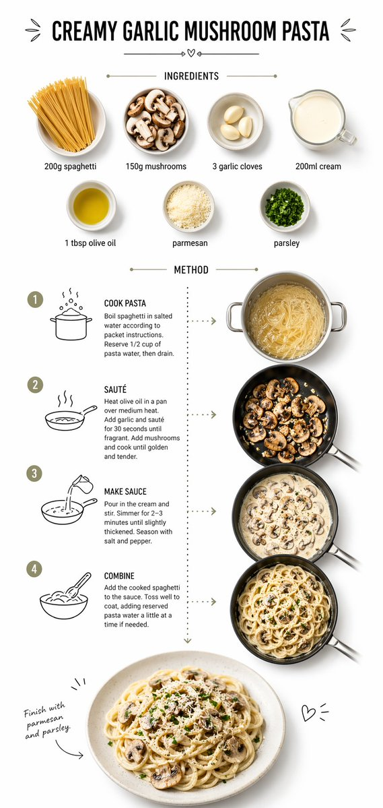</a></p>

<details>
<summary><b>Prompt</b> — Show full prompt</summary>

```text
Create step-by-step recipe infographic for creamy garlic mushroom pasta, top-down view, minimal style on white background, ingredient photos labeled: "200g spaghetti", "150g mushrooms", "3 garlic cloves", "200ml cream", "1 tbsp olive oil", "parmesan", "parsley", dotted lines showing process steps with icons (boiling pot, sauté pan, mixing), final plated pasta shot at the bottom
```

</details>

[📖 View on Tosea](https://tosea.ai/prompts/gpt-image-2#11-create-step-by-step)

---

### 13. Create a 10 × 10 grid of 100

*by [**proper**](https://t.co/clpekLD0KH)*

<a id="13-create-a-grid-of"></a>
<p align="center"><a href="images/13.jpg">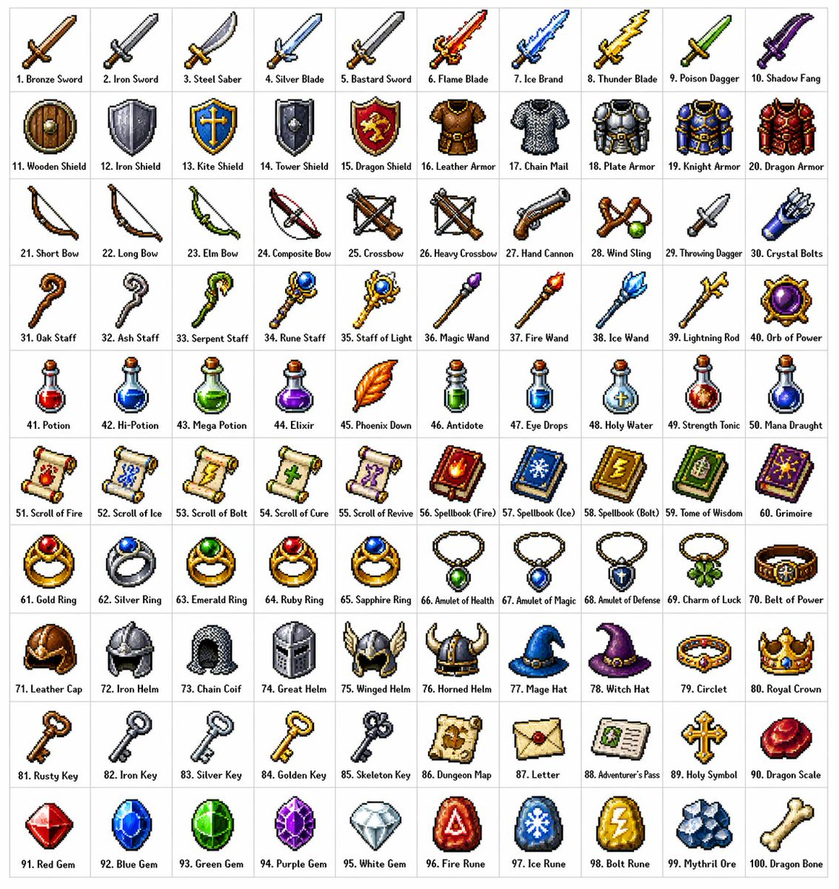</a></p>

<details>
<summary><b>Prompt</b> — Show full prompt</summary>

```text
Create a 10 × 10 grid of 100 different fantasy RPG items rendered in classic pixel art style (16-bit or 32-bit sprite aesthetic, reminiscent of SNES/GBA-era JRPGs). Each item should appear in its own square tile with a short clear label underneath. Keep the grid neat on a white background. Make every item visually distinct and every label correctly spelled. Use crisp pixel edges, limited palette per sprite, and subtle dithering for shading. Use these row themes: Row 1: swords and blades Row 2: shields and armor Row 3: bows, crossbows, and ranged weapons Row 4: staves, wands, and magical foci Row 5: potions, elixirs, and flasks Row 6: scrolls, tomes, and spellbooks Row 7: rings, amulets, and enchanted trinkets Row 8: helmets, crowns, and headgear Row 9: keys, relics, and quest items Row 10: gems, runes, and crafting materials Show each tile as a centered item sprite on a clean background square, rendered as a classic inventory icon — the kind you'd see in a fantasy RPG menu. Keep the overall style consistent, cohesive, and reminiscent of beloved retro fantasy RPGs — charming, detailed, and instantly readable at small sizes.
```

</details>

[📖 View on Tosea](https://tosea.ai/prompts/gpt-image-2#13-create-a-grid-of)

---

### 17. Please create a cartoon-style infographic based on the

*by [**宝玉**](https://t.co/TUu5bu52Lp)*

<a id="17-please-create-a-cartoon"></a>
<p align="center"><a href="images/17.jpg">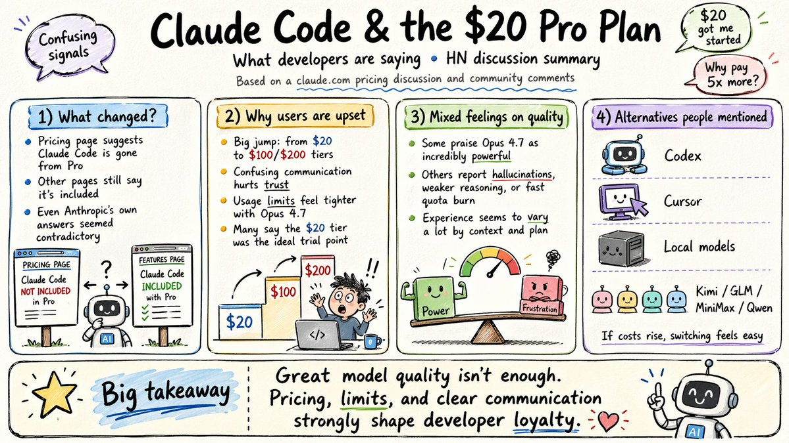</a></p>

<details>
<summary><b>Prompt</b> — Show full prompt</summary>

```text
Please create a cartoon-style infographic based on the provided content, following these guidelines: - Hand-drawn illustration style, landscape orientation (16:9 aspect ratio). - Include a small number of simple cartoon elements, icons, or famous personalities to enhance visual interest and memorability. - If the content includes sensitive or copyrighted figures, replace them with visually similar alternatives; do not refuse to generate the illustration. - All imagery and text must strictly adhere to a hand-drawn style; avoid realistic visual elements. - Keep information concise, highlighting keywords and core concepts. Utilize ample whitespace to clearly emphasize key points. - Unless otherwise specified, use the same language as the provided content. Please create the illustration based on the input provided.
```

</details>

[📖 View on Tosea](https://tosea.ai/prompts/gpt-image-2#17-please-create-a-cartoon)

---

### 21. A professional screenshot of a TikTok creator in-app

*by [**Mark Kretschmann**](https://t.co/b596y29yUM)*

<a id="21-a-professional-screenshot-of"></a>
<p align="center"><a href="images/21.jpg">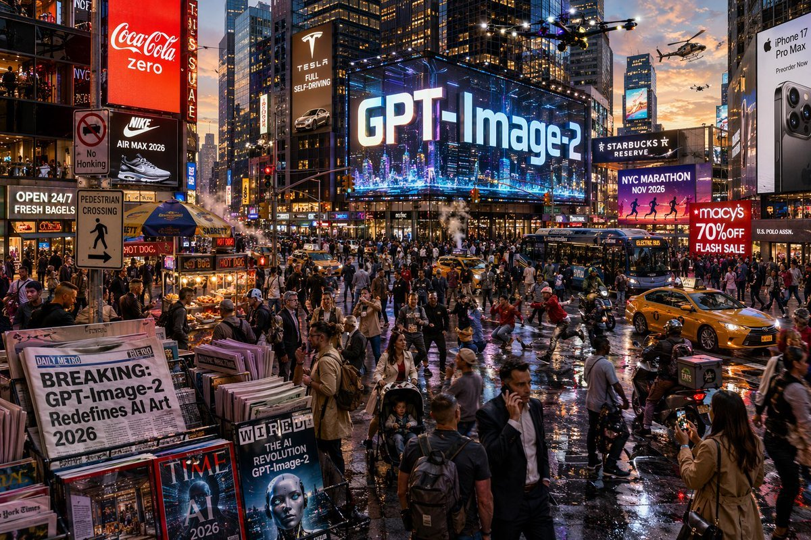</a></p>

<details>
<summary><b>Prompt</b> — Show full prompt</summary>

```text
A professional screenshot of a TikTok creator in-app message interface from a mobile device, showing a chat discussion regarding a collaboration. The messenger is 'tk' (TikTok), identified by a profile picture of a white stylized 'T' within a teal circle, and the header displays "Chat (1)" and "tk", with a video camera and three-dot menu icons in the top right. At the bottom of the screen, there are three consecutive chat bubbles from 'tk'. The first bubble contains a single photo of a young woman with a long ponytail, in profile, working with her hands on a device (possibly making a ring) at a workshop table. The second bubble reads: "They can make a video feature your products, that the duration would be around 30 to 60 seconds with 1 link". The third bubble reads: "The collaboration will require a security deposit of ₱1500 to ₱2000, but no worries, because it is fully refundable after the collaboration is done." The message input field is at the bottom, reading "Message...", with camera, microphone, and emoji icons. Below the chat window are bottom navigation icons for Home, Friends, a black plus button, Inbox (highlighted), and Profile. The background is a clean white/light gray interface. The time '08:08' is visible at the very top left.
```

</details>

[📖 View on Tosea](https://tosea.ai/prompts/gpt-image-2#21-a-professional-screenshot-of)

---

### 23. Generate a high-quality vertical "science popularization encycl…

*by [**Fanis**](https://t.co/3UGGmP2NwA)*

<a id="23-generate-a-high-quality"></a>
<p align="center"><a href="images/23.jpg">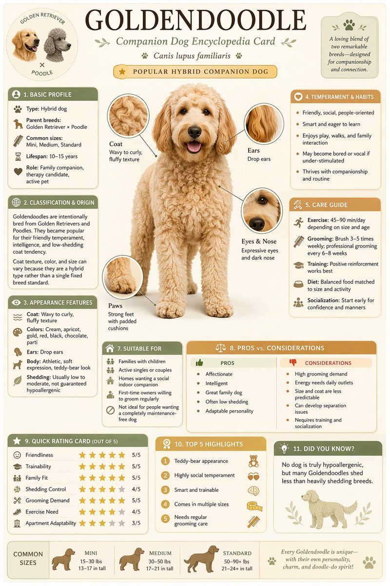</a></p>

<details>
<summary><b>Prompt</b> — Show full prompt</summary>

```text
Generate a high-quality vertical "science popularization encyclopedia image" based on [Theme]. This image is not an ordinary poster, nor is it purely an illustration; it's a modular science information graphic that combines "atlas-like feel, encyclopedic feel, information structure, and collectible appeal." The overall style references a blend of advanced natural history atlases, modern encyclopedia pages, lifestyle knowledge cards, and highly shareable social media infographics. Please include in the image: - A clear and beautiful main visual of the theme - Several magnified close-up details of partial features - Multiple rounded modular information sections - Clear title hierarchy and key labels - Concise yet rich encyclopedic content - Visualized ratings, key point summaries, or Top 5 modules Content sections should automatically adapt based on the theme, prioritizing selection and reasonable combination from these directions: Basic profile, classification info, appearance features, habits/ecology, formation mechanism/structure composition, growth or usage conditions, care or maintenance tips, risks and precautions, suitable people or application scenarios, pros and cons comparison, quick rating card. Visual requirements: Light, clean background; soft color palette; subtle shadows; refined small icons; rounded info boxes; neat typography; high information density without clutter; excellent reading experience. The overall design must feel like a genuine science encyclopedia card that can be published, read, collected, and produced in series—not like an ad graphic. Please don't make it into an ordinary commercial promotional poster. Emphasize the features of "knowledge organization + modular info + atlas-style presentation.
```

</details>

[📖 View on Tosea](https://tosea.ai/prompts/gpt-image-2#23-generate-a-high-quality)

---

### 27. Search the web for the latest and most accurate information fro…

*by [**Alex Patrascu**](https://x.com/maxescu/status/2045096239713394862)*

<a id="27-search-the-web-for"></a>
<p align="center"><a href="images/27.jpg">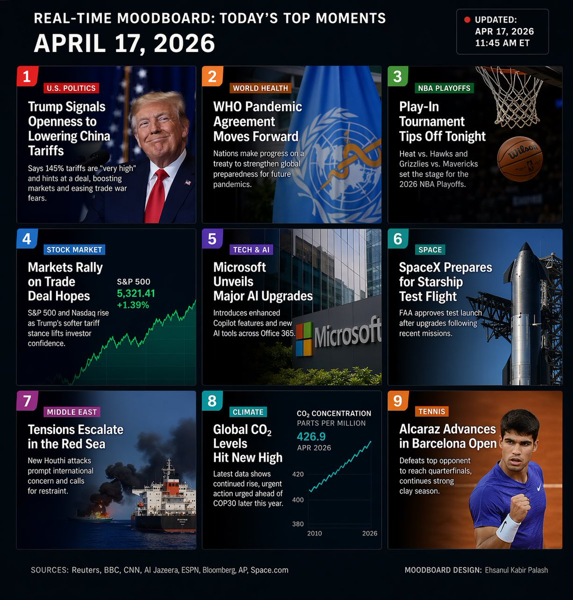</a></p>

<details>
<summary><b>Prompt</b> — Show full prompt</summary>

```text
Search the web for the latest and most accurate information from today, April 17, 2026. Then generate the ultimate 3×3 real-time moodboard with accurate information: 9 squares capturing today’s biggest moments across news, sports, finance, and world events, unified modern news aesthetic, perfect consistency, and detail. Search the web to make sure today's events are represented. Figure out the perfect prompt for it. Double check the news to make sure they are accurate and from today.
```

</details>

[📖 View on Tosea](https://tosea.ai/prompts/gpt-image-2#27-search-the-web-for)

---

### 30. An oil painting in the exact style of

*by [**fabian**](https://t.co/Dmsn7GYeef)*

<a id="30-an-oil-painting-in"></a>
<p align="center"><a href="images/30.jpg">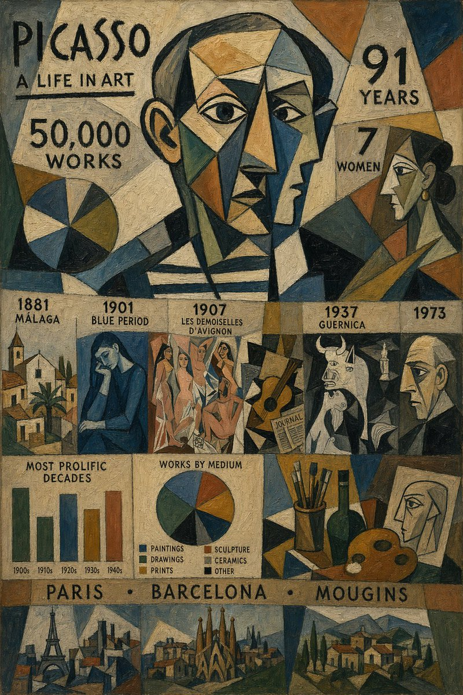</a></p>

<details>
<summary><b>Prompt</b> — Show full prompt</summary>

```text
An oil painting in the exact style of Pablo Picasso — combining Cubist fragmentation, bold black outlines, flat geometric planes of color, and distorted faces — but the subject of the painting is an infographic about the life of Picasso himself. The painting contains visual infographic elements rendered in Picasso’s own artistic language: A large cubist self-portrait of Picasso at the center, face fragmented into multiple simultaneous angles, one eye frontal, one in profile A painted timeline running across the canvas showing key dates: “1881 MÁLAGA” at the left, “1901 BLUE PERIOD”, “1907 LES DEMOISELLES D’AVIGNON”, “1937 GUERNICA”, “1973” at the right — all rendered as hand-painted text in rough brushstrokes Small cubist vignettes along the timeline showing his different periods: a melancholy blue figure, a rose-toned harlequin, angular cubist guitar and newspaper collage, the Guernica bull Painted bar charts and pie charts rendered in cubist style — geometric, fragmented, using a palette of ochre, terracotta, slate blue, black, white, and olive green Statistics painted as bold text: “50,000 WORKS”, “91 YEARS”, “7 WOMEN”, “PARIS • BARCELONA • MOUGINS” Visible brushstrokes with thick impasto texture and the characteristic Picasso palette The entire composition looks like a real Picasso painting that happens to contain infographic data Canvas texture clearly visible, oil paint medium, museum-quality execution Portrait orientation, tall format. The piece should feel like it belongs on a gallery wall, not a computer screen.
```

</details>

[📖 View on Tosea](https://tosea.ai/prompts/gpt-image-2#30-an-oil-painting-in)

---

### 31. Prepare a travel guide infographic for Istanbul that

*by [**ai.gezgini**](https://t.co/K2Wm0v9Bqv)*

<a id="31-prepare-a-travel-guide"></a>
<p align="center"><a href="images/31.jpg">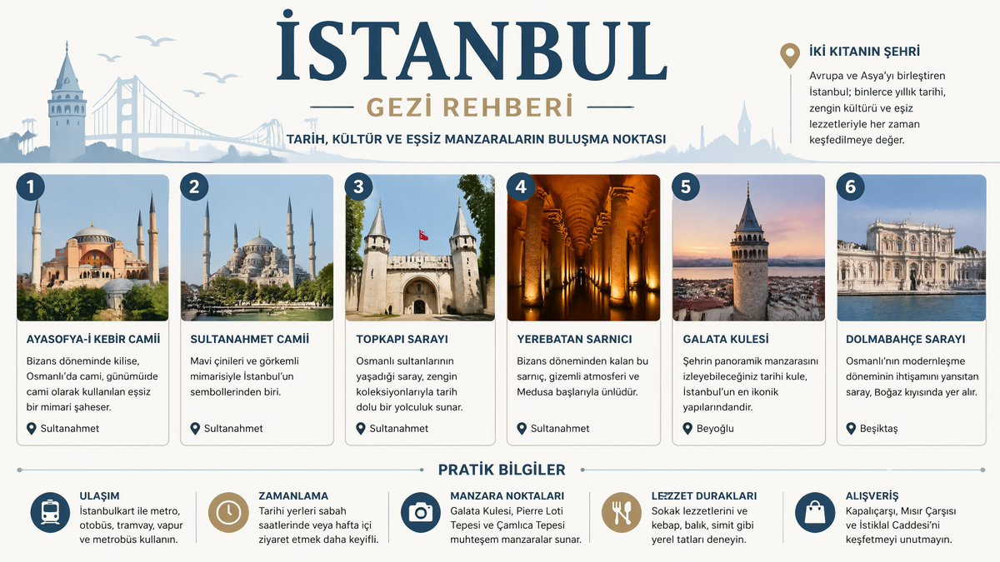</a></p>

<details>
<summary><b>Prompt</b> — Show full prompt</summary>

```text
Prepare a travel guide infographic for Istanbul that includes short and concise information on 6 important historical and touristic landmarks.
```

</details>

[📖 View on Tosea](https://tosea.ai/prompts/gpt-image-2#31-prepare-a-travel-guide)

---

### 32. Create a detailed infographic about Hagia Sophia, add notations…

*by [**ai.gezgini**](https://t.co/HvgZRlBXOd)*

<a id="32-create-a-detailed-infographic"></a>
<p align="center"><a href="images/32.jpg">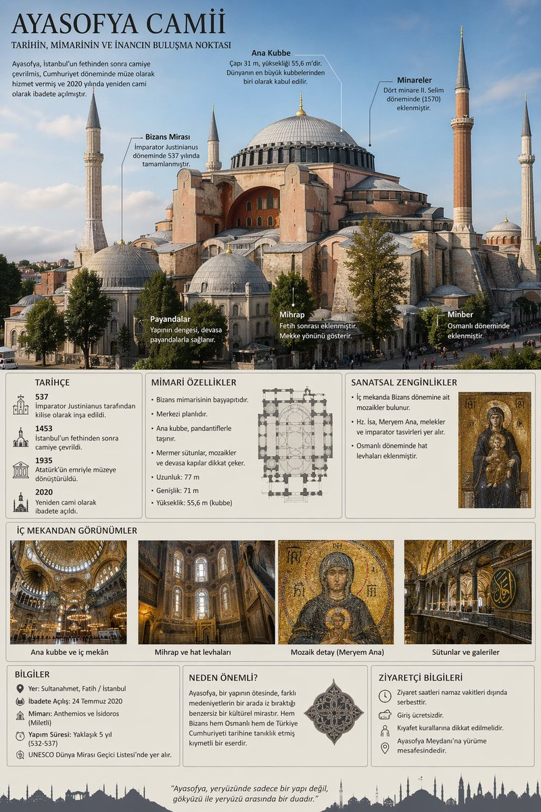</a></p>

<details>
<summary><b>Prompt</b> — Show full prompt</summary>

```text
Create a detailed infographic about Hagia Sophia, add notations on a realistic image
```

</details>

[📖 View on Tosea](https://tosea.ai/prompts/gpt-image-2#32-create-a-detailed-infographic)

---

### 35. - Generating accurate text in images, across multiple

*by [**Katia Gil Guzman**](https://t.co/eXR9hRgTr7)*

<a id="35-generating-accurate-text-in"></a>
<p align="center"><a href="images/35.jpg">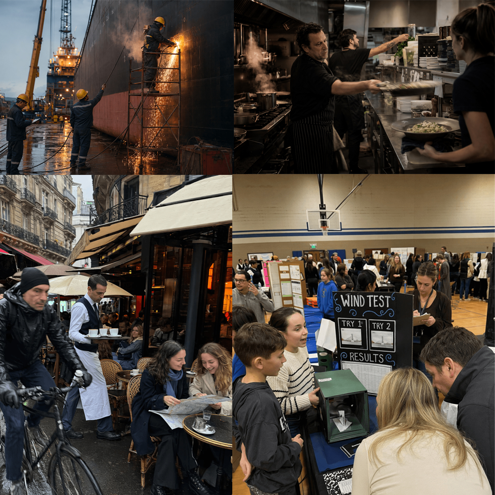</a></p>

<details>
<summary><b>Prompt</b> — Show full prompt</summary>

```text
- Generating accurate text in images, across multiple languages and alphabets - Creating realistic UI screenshots and product mockups - Understanding the real world, with a dec 25 knowledge cutoff
```

</details>

[📖 View on Tosea](https://tosea.ai/prompts/gpt-image-2#35-generating-accurate-text-in)

---

### 36. authentic IKEA instruction manual page

*by [**Shruti**](https://t.co/j0JSd7MqGY)*

<a id="36-prompt-scene-a-perfectly"></a>
<p align="center"><a href="images/36.jpg">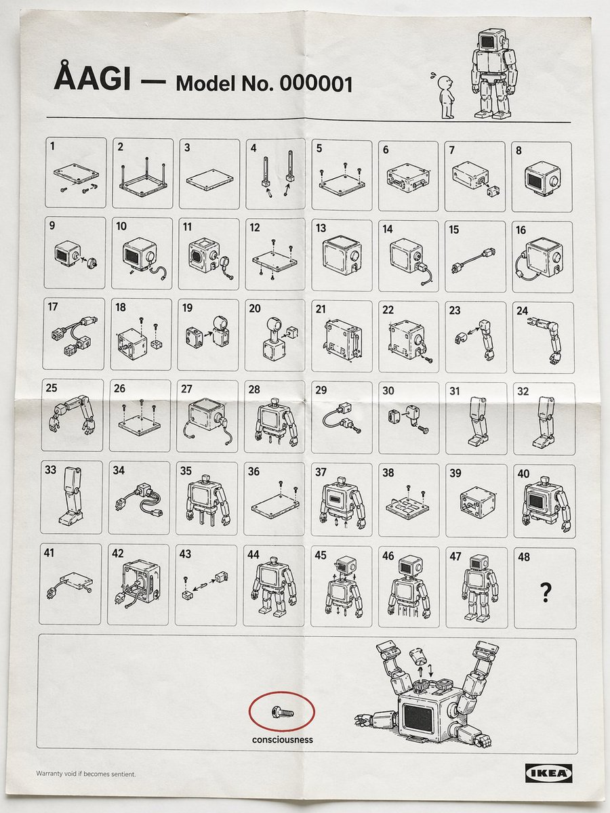</a></p>

<details>
<summary><b>Prompt</b> — Show full prompt</summary>

```text
{ "prompt": { "scene": "A perfectly authentic IKEA instruction manual page, flat lay on a white surface, photographed from directly above. The sheet is A4 sized, slightly creased like it came folded in a box. The title at the top reads 'ÅAGI — Model No. 000001' in classic IKEA black bold font. A small wordless stick figure human stands next to a giant robot in the top header, looking up at it with a tiny sweat drop. Steps 1 through 47 show normal IKEA-style wordless diagrams — bolts, panels, wires connecting in logical sequences, the robot slowly taking shape across the grid. Step 48 is a large empty white box with only a single bold black question mark dead center. The final assembled image in the bottom right corner shows the robot built completely wrong — one arm where the head should be, legs pointing upward, screen on backwards. A single screw sits outside the robot circled in red labeled 'consciousness.' At the very bottom in tiny IKEA grey fine print: 'Warranty void if becomes sentient.' The IKEA logo sits in the bottom right corner.", "style": "hyper-realistic flat lay product photography, authentic IKEA manual illustration style, black and white line diagrams on off-white slightly textured paper, clean Scandinavian minimalism", "mood": "deadpan, absurdist, instantly recognizable", "aspect_ratio": "4:5", "lighting": "soft flat overhead diffused light, subtle paper texture shadows, no harsh reflections", "details": [ "IKEA font must be exact — Noto Sans or close equivalent, bold black headers", "Steps 1-47 must look like a real progression, not random", "Step 48 box must be the same size as other steps but completely empty except the question mark", "The single leftover screw labeled 'consciousness' must be clearly readable", "Fine print at the bottom must be legible but small — authentic IKEA warning text size", "Paper should look slightly worn, folded crease down the middle", "Robot in final step visibly, unmistakably assembled wrong" ] } }
```

</details>

[📖 View on Tosea](https://tosea.ai/prompts/gpt-image-2#36-prompt-scene-a-perfectly)

---

### 39. create an infographic about the reign of Philip II, at the heig…

*by [**OscarAI**](https://t.co/9ILtBvNKX7)*

<a id="39-create-an-infographic-about"></a>
<p align="center"><a href="images/39.jpg">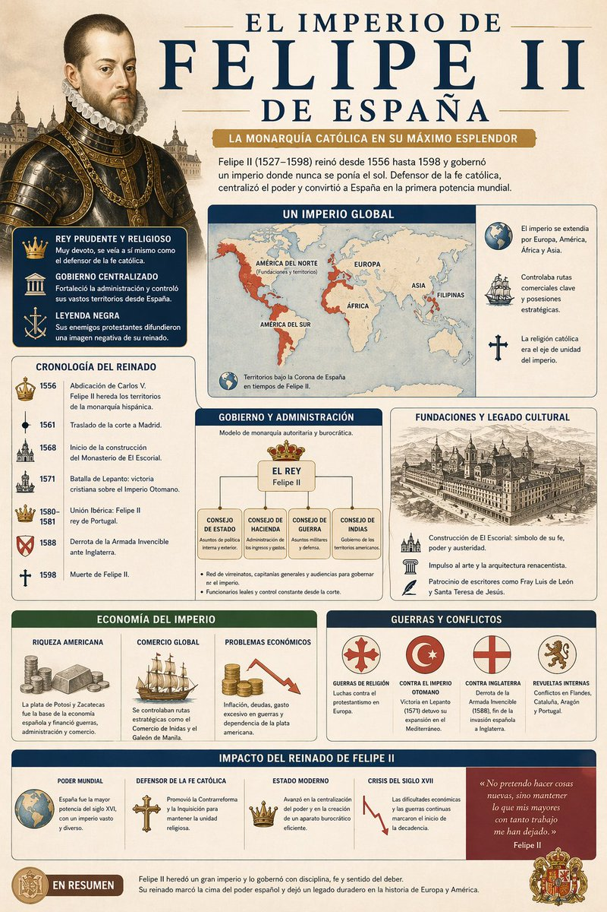</a></p>

<details>
<summary><b>Prompt</b> — Show full prompt</summary>

```text
create an infographic about the reign of Philip II, at the height of the Spanish Empire
```

</details>

[📖 View on Tosea](https://tosea.ai/prompts/gpt-image-2#39-create-an-infographic-about)

---

### 40. a satellite map of London, showing a close up of the area aroun…

*by [**fofr**](https://t.co/g22VELwevN)*

<a id="40-a-satellite-map-of"></a>
<p align="center"><a href="images/40.jpg">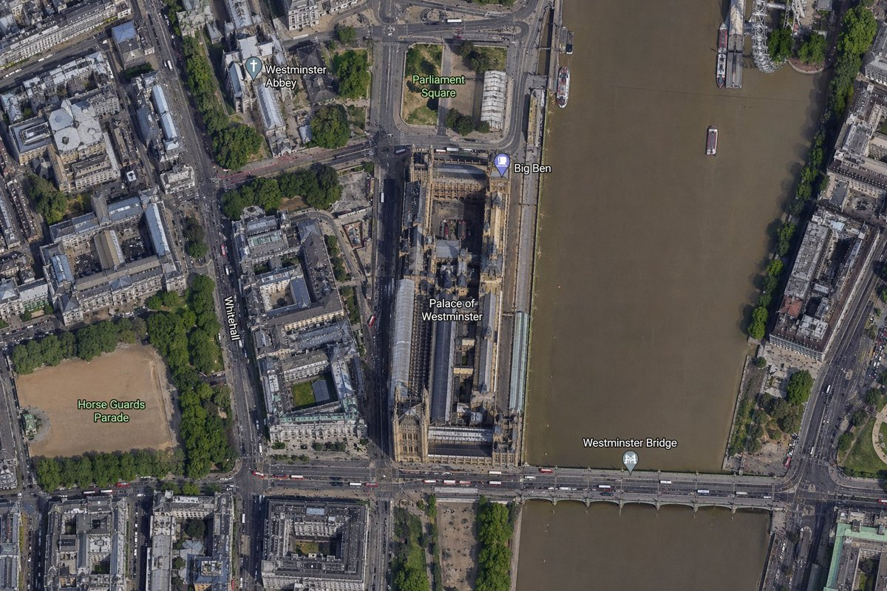</a></p>

<details>
<summary><b>Prompt</b> — Show full prompt</summary>

```text
a satellite map of London, showing a close up of the area around Big Ben
```

</details>

[📖 View on Tosea](https://tosea.ai/prompts/gpt-image-2#40-a-satellite-map-of)

---

### 41. Create an image with 10x10 grid of objects that have the names…

*by [**Umesh**](https://t.co/AUKgSNjeOW)*

<a id="41-create-an-image-with"></a>
<p align="center"><a href="images/41.jpg"></a></p>

<details>
<summary><b>Prompt</b> — Show full prompt</summary>

```text
create an image with 10x10 grid of objects that have the names starting with letter a
```

</details>

[📖 View on Tosea](https://tosea.ai/prompts/gpt-image-2#41-create-an-image-with)

---

### 48. 设计一张2026年4月16日的老黄历

*by [**WY**](https://t.co/cGgQ3Quw6J)*

<a id="prompt-48"></a>
<p align="center"><a href="images/48.jpg">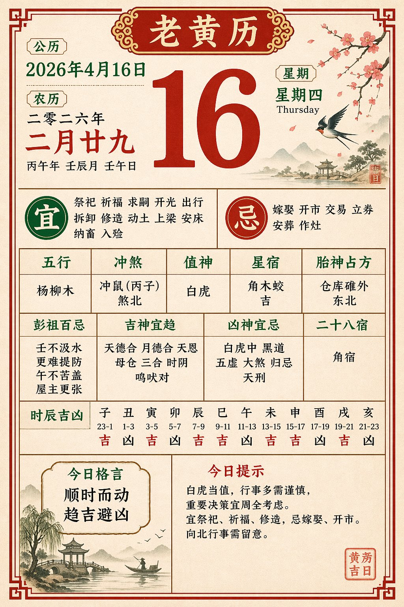</a></p>

<details>
<summary><b>Prompt</b> — Show full prompt</summary>

```text
设计一张2026年4月16日的老黄历
```

</details>

[📖 View on Tosea](https://tosea.ai/prompts/gpt-image-2#prompt-48)

---

### 49. Based on everything you know about me, make

*by [**宝玉**](https://t.co/6x0DHb2MCQ)*

<a id="49-based-on-everything-you"></a>
<p align="center"><a href="images/49.jpg">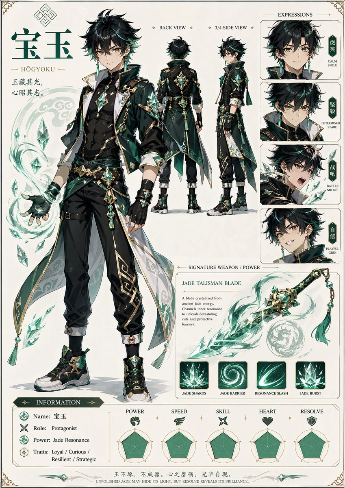</a></p>

<details>
<summary><b>Prompt</b> — Show full prompt</summary>

```text
Based on everything you know about me, make a character sheet of shonen-style anime character of me, name is 宝玉
```

</details>

[📖 View on Tosea](https://tosea.ai/prompts/gpt-image-2#49-based-on-everything-you)

---

### 50. 请根据【主题】生成一张高质量竖版「科普百科图」。

*by [**Larus Canus**](https://t.co/QHov2LPflT)*

<a id="50-top"></a>
<p align="center"><a href="images/50.jpg"></a></p>

<details>
<summary><b>Prompt</b> — Show full prompt</summary>

```text
请根据【主题】生成一张高质量竖版「科普百科图」。 这张图不是普通海报，也不是单纯插画，而是一张兼具“图鉴感、百科感、信息结构感、收藏感”的模块化科普信息图。整体风格参考高级博物图鉴、现代百科书页、生活方式知识卡和社交媒体高传播信息图的结合。 请让画面包含： - 一个清晰漂亮的主题主视觉 - 若干局部特征放大细节 - 多个圆角模块化信息分区 - 清楚的标题层级与重点标签 - 简洁但丰富的百科内容 - 可视化评分、要点总结或Top 5模块 内容栏目请根据主题自动适配，优先从这些方向中选择并合理组合： 基础档案、分类信息、外观特征、习性/生态、形成机制/结构组成、生长或使用条件、养护或维护建议、风险与注意事项、适合人群或适用场景、优缺点对比、快速评分卡。 视觉要求： 浅色干净背景，柔和配色，轻阴影，精致小图标，圆角信息框，整洁排版，信息密度高但不拥挤，阅读体验好。整体必须像真正可以发布、阅读、收藏、系列化生产的科普百科卡，而不是广告图。 请不要做成普通商业宣传海报。要突出“知识整理 + 模块信息 + 图鉴式展示”的特征。
```

</details>

[📖 View on Tosea](https://tosea.ai/prompts/gpt-image-2#50-top)

---

### 53. - Best-in-class text recognition; nearly perfect, only minor

*by [**Eli5DeFi**](https://t.co/49Eo2nj69e)*

<a id="53-best-in-class-text"></a>
<p align="center"><a href="images/53.jpg">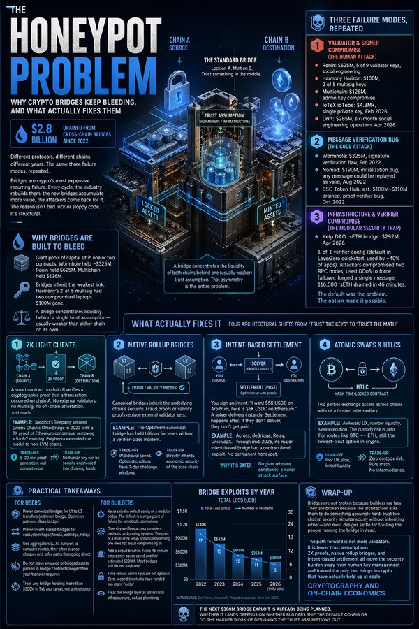</a></p>

<details>
<summary><b>Prompt</b> — Show full prompt</summary>

```text
- Best-in-class text recognition; nearly perfect, only minor errors - Infographic output is ridiculously good - Stronger with complex, multi-element work (infographics, data, design) - Minimal hallucinations - A bit slower than NB - The editing features are a godsend
```

</details>

[📖 View on Tosea](https://tosea.ai/prompts/gpt-image-2#53-best-in-class-text)

---

### 54. Make a detailed step by step timeline of

*by [**Glenn Williams**](https://t.co/yUttjisfy1)*

<a id="54-make-a-detailed-step"></a>
<p align="center"><a href="images/54.jpg">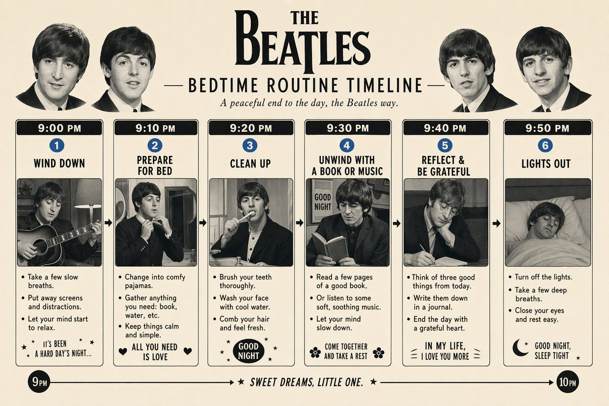</a></p>

<details>
<summary><b>Prompt</b> — Show full prompt</summary>

```text
Make a detailed step by step timeline of a bed time routine from 9PM to 10PM, in the style of The Beatles
```

</details>

[📖 View on Tosea](https://tosea.ai/prompts/gpt-image-2#54-make-a-detailed-step)

---

### 55. A photorealistic, taken by phone photo of a

*by [**Chetaslua**](https://t.co/PlQnnZfORL)*

<a id="55-a-photorealistic-taken-by"></a>
<p align="center"><a href="images/55.jpg">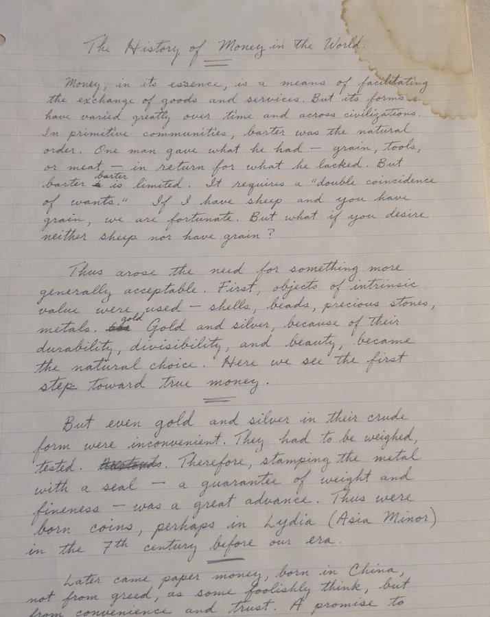</a></p>

<details>
<summary><b>Prompt</b> — Show full prompt</summary>

```text
a photorealistic, taken by phone photo of a handwritten essay in pencil, albert einstien handwriting, on an 8.5x11 piece of lined paper, about the history of money in world. make sure there is variance in the writing in a very einstien way. give it a slight coffee stain on the top right corner
```

</details>

[📖 View on Tosea](https://tosea.ai/prompts/gpt-image-2#55-a-photorealistic-taken-by)

---

### 56. A detailed cutaway drawing of a Boeing 747

*by [**bing howenstein**](https://t.co/uyMZ3DPIoP)*

<a id="56-a-detailed-cutaway-drawing"></a>
<p align="center"><a href="images/56.jpg">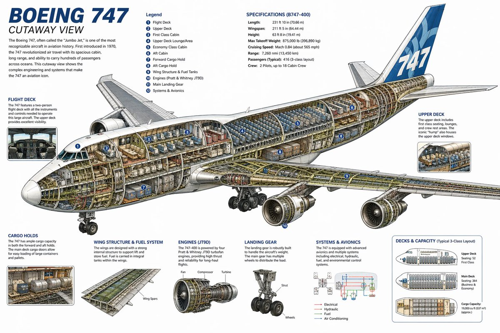</a></p>

<details>
<summary><b>Prompt</b> — Show full prompt</summary>

```text
A detailed cutaway drawing of a Boeing 747
```

</details>

[📖 View on Tosea](https://tosea.ai/prompts/gpt-image-2#56-a-detailed-cutaway-drawing)

---

## Social Media & Branding

### 02. Create a polished email sequence template for fenty beauty

*by [**Salma**](https://t.co/ExdwLNyvbT)*

<a id="02-create-a-polished-email"></a>
<p align="center"><a href="images/02.jpg"></a></p>

<details>
<summary><b>Prompt</b> — Show full prompt</summary>

```text
"Create a polished email sequence template for fenty beauty"
```

</details>

[📖 View on Tosea](https://tosea.ai/prompts/gpt-image-2#02-create-a-polished-email)

---

### 15. Create a polished multi-page (multiple images) brand kitfor a c…

*by [**RIO**](https://t.co/DvVbnrVeD9)*

<a id="15-create-a-polished-multi"></a>
<p align="center"><a href="images/15.jpg"></a></p>

<details>
<summary><b>Prompt</b> — Show full prompt</summary>

```text
Create a polished multi-page (multiple images) brand kitfor a company called YOYOYO. The brand should feelplayful, futuristic, vibrant, and design-forward, blendingthe energy of a toy-inspired product with thesophistication of a premium creative tech brand. Use abold, experimental visual identity with bright color, cleangeometry, modern typography, dynamic motion cues,and slightly surreal imagery. The overall mood should feelinventive, youthful, rhythmic, tactile, and high-concept,with a balance of fun consumer product culture, fashion-like presentation, and contemporary digital design.Include a sense of product obsession, visualexperimentation, packaging exploration, editorialphotography, immersive retail, and cross-platform brandapplication. Make it feel like a confident, contemporarybrand world that is both accessible and art-directed, withstrong graphic cohesion and a premium creative-studioaesthetic.
```

</details>

[📖 View on Tosea](https://tosea.ai/prompts/gpt-image-2#15-create-a-polished-multi)

---

### 19. Editorial fashion lookbook, 4:5 aspect ratio, for a fictional b…

*by [**Justin Rands**](https://t.co/s9xIhjENm8)*

<a id="19-editorial-fashion-lookbook-aspect"></a>
<p align="center"><a href="images/19.jpg">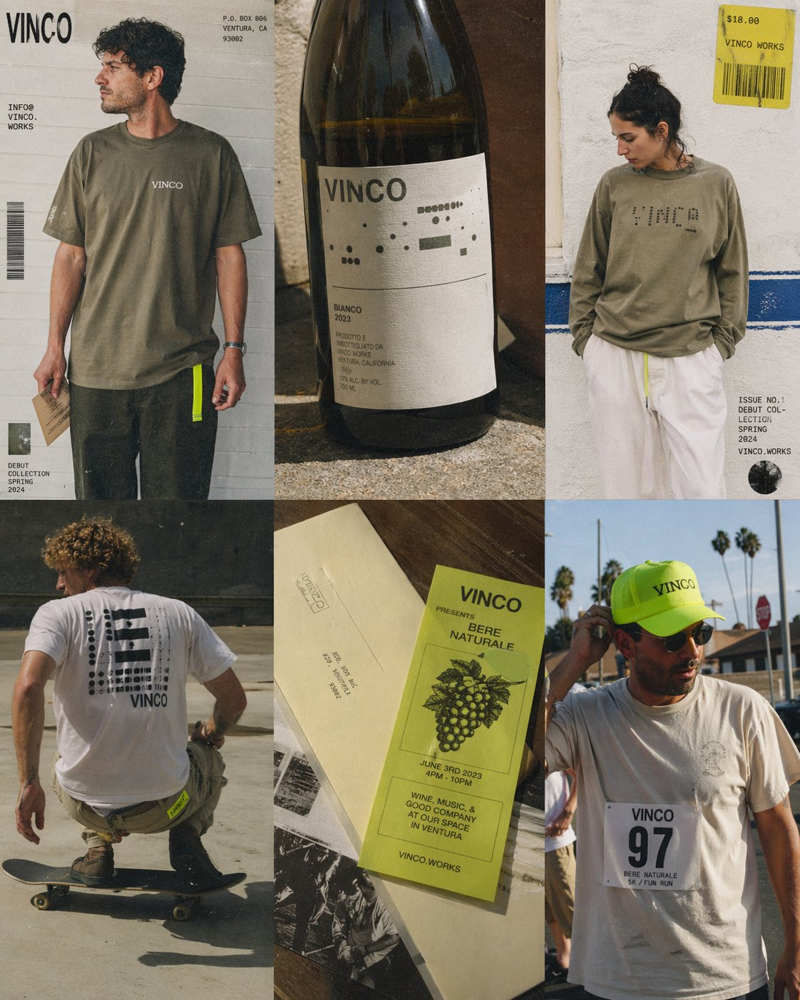</a></p>

<details>
<summary><b>Prompt</b> — Show full prompt</summary>

```text
Editorial fashion lookbook, 4:5 aspect ratio, for a fictional brandcalled VINCO. Shoot a 6-image series for their debut collection. Thecreative direction references Italian archival graphic design (Olivetti,Archivio Grafica Italiana) colliding with late-90s Southern Californiastreetwear - sun-faded, slightly chaotic, but typographicallydisciplined. The collection lives between natural wine culture andskate utility. Models should feel like real people, not fashion models -specific faces, unselfconscious posture, midday outdoor light.Clothing is unstructured, earthy-toned with one fluorescent accentpiece per look. Typography appears in frame as physical objects -printed cards, stamped envelopes, event flyers held or worn or lyingnearby. Each image should feel like it was pulled from a differentcontext - a mailer, a record sleeve, a wine label, a race bib - butthey all belong to the same world. Gritty but considered. Sun-bleached but precise.
```

</details>

[📖 View on Tosea](https://tosea.ai/prompts/gpt-image-2#19-editorial-fashion-lookbook-aspect)

---

### 24. Create a detailed summer banner ad for an Italian soda.

*by [**Fanis**](https://t.co/RphjDsEqge)*

<a id="24-create-a-detailed-summer"></a>
<p align="center"><a href="images/24.jpg">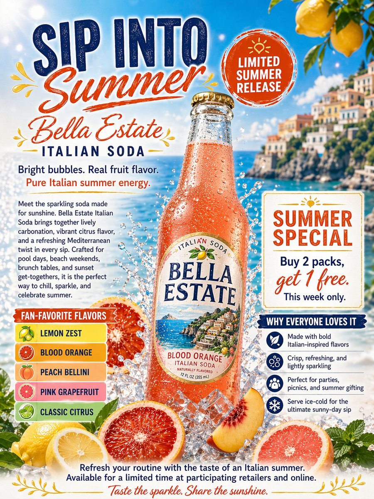</a></p>

<details>
<summary><b>Prompt</b> — Show full prompt</summary>

```text
Create a detailed summer banner ad for an Italian soda. Research for the most trending CTAs in the drinks category for 2025 and use them as taglines. (do not add this text)
```

</details>

[📖 View on Tosea](https://tosea.ai/prompts/gpt-image-2#24-create-a-detailed-summer)

---

### 25. Photorealistic bold beauty campaign using uploaded model as exa…

*by [**Fanis**](https://t.co/MHnI1PTouA)*

<a id="25-photorealistic-bold-beauty-campaign"></a>
<p align="center"><a href="images/25.jpg">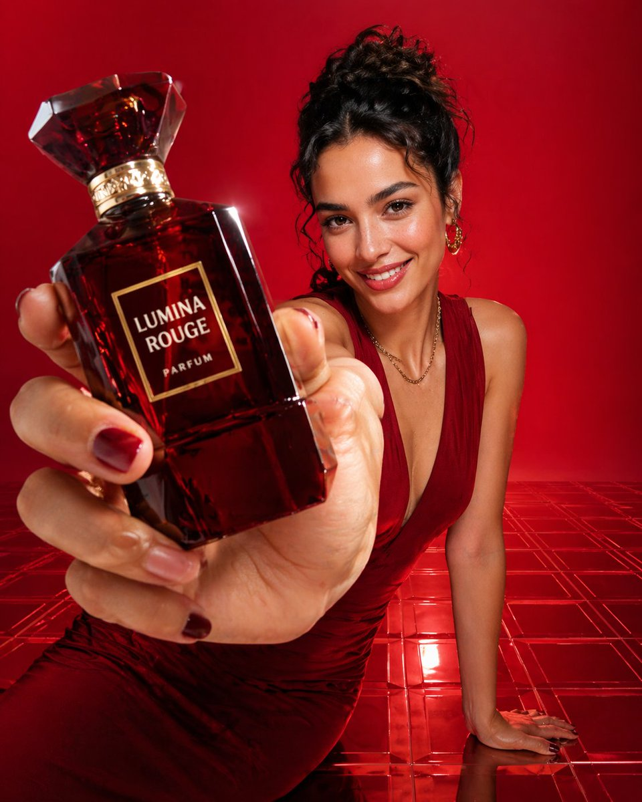</a></p>

<details>
<summary><b>Prompt</b> — Show full prompt</summary>

```text
Photorealistic bold beauty campaign using uploaded model as exact identity reference. No facial changes, no smoothing. Scene: deep red saturated studio environment with high-contrast floor pattern or glossy surface. Product: the product held or positioned extremely close to the lens, appearing large due to perspective. Model pose: playful or confident smile, arm fully extended toward camera, fingers slightly distorted by wide lens. Strong eye contact through sunglasses or natural gaze. Camera: ultra-wide 20–28mm aesthetic, dynamic foreground exaggeration, shallow-to-medium depth of field. Lighting: punchy commercial lighting with defined highlights and reflections, crisp packaging edges, vibrant color grading. Hyper-detailed skin texture and fabric realism.
```

</details>

[📖 View on Tosea](https://tosea.ai/prompts/gpt-image-2#25-photorealistic-bold-beauty-campaign)

---

### 45. 一张[瑞士/日式/北欧/法式]简约设计的"都市牛马一周穿搭指南"信息图，超高清8K分辨率,顶级商业时尚摄影风格。

*by [**沐阳**](https://t.co/e7RWd3P6AC)*

<a id="45-k-monday-tuesday-wednesday"></a>
<p align="center"><a href="images/45.jpg"></a></p>

<details>
<summary><b>Prompt</b> — Show full prompt</summary>

```text
一张[瑞士/日式/北欧/法式]简约设计的"都市牛马一周穿搭指南"信息图，超高清8K分辨率,顶级商业时尚摄影风格。 信息如下： 性别：[男性] 年龄段：[20-25岁] 职业场景：[职场上班族] 身材类型：[修长] 2. 风格偏好 主风格：[休闲装] 色彩倾向：[冷色调] 穿搭态度：[稳健时尚] 3. 场景需求 工作环境：[写字楼] 社交频率：[无社交] 特殊需求：[需要运动装等] 【画面布局与设计】 极简时杂志风格，[横向长图]排列。画面分为七个独立展示区（周一至周日），每个区域包含： - 一位[年龄段][种族]模特的全身穿搭展示 - 侧边悬浮的单品特写（材质细节、配饰） - 极简中文排版说明文字（字体：思源黑体/苹方/阿里巴巴普惠体） 背景为[高级冷灰/米白/奶茶色]。 【人物特征】 [年龄]岁[种族][性别]，[职业气质]，五官[特征描述]，发型[描述]，表情自信从容，姿态自然放松，皮肤质感真实细腻。 【一周穿搭方案 - [主风格]】 **周一（MONDAY）- [场景：重要会议/正式商务]** - 穿着：[详细描述上衣+下装+外套] - 鞋履：[鞋款+材质+颜色] - 配饰：[3-5件配饰] - 风格关键词：[3个形容词] - 配色方案：[主色+辅色+点缀色] - 正式度：★★★★★ 舒适度：★★★☆☆ **周二（TUESDAY）- [场景：日常通勤]** [同上格式] **周三（WEDNESDAY）- [场景：团队协作/商务休闲]** [同上格式] **周四（THURSDAY）- [场景：外出拜访/客户会面]** [同上格式] **周五（FRIDAY）- [场景：休闲办公/社交]** [同上格式] **周六（SATURDAY）- [场景：周末活动/运动休闲]** [同上格式] **周日（SUNDAY）- [场景：居家/约会/城市漫步]** [同上格式] 【中文标注设计元素】 - 每个板块标注：   - 场景标签（中文）   - Pantone色卡条   - 五星评级：正式度 ★★★★☆ / 舒适度 ★★★★☆   - 面料标注：[羊毛/棉/羊绒/真丝等]（中文+图标）   - 价格区间标识（可选）   - 季节适配图标    - 整体排版参考：《KINFOLK》《GQ》杂志内页风格 - 字体系统：   - 标题：思源黑体 Bold / 苹方特粗   - 正文：苹方常规 / 思源宋体   - 英文点缀：Helvetica Neue / Futura - 留白充足，视觉呼吸感强 【技术渲染参数】 Unreal Engine 5渲染 | 光线追踪 | 全局光照 | 面料微距细节（羊毛纹理、皮革毛孔、织物肌理）清晰可见 | 景深自然（f/2.8-f/4）| 色彩准确校正 | 电影级调色 | 高动态范围HDR | 构图遵循黄金比例 | 8K超清分辨率
```

</details>

[📖 View on Tosea](https://tosea.ai/prompts/gpt-image-2#45-k-monday-tuesday-wednesday)

---

### 46. Redesign this product advertisement from the perspective of a p…

*by [**GENEL | AIを用いた動画制作**](https://t.co/mKM9bmC2LC)*

<a id="46-redesign-this-product-advertisement"></a>
<p align="center"><a href="images/46.jpg"></a></p>

<details>
<summary><b>Prompt</b> — Show full prompt</summary>

```text
Redesign this product advertisement from the perspective of a professional designer. With a refined design that aligns with current trends and the target audience.
```

</details>

[📖 View on Tosea](https://tosea.ai/prompts/gpt-image-2#46-redesign-this-product-advertisement)

---

### 47. Create an ad for iced coffee.

*by [**KAWAI**](https://t.co/XQg0qPJfp8)*

<a id="47-create-an-ad-for"></a>
<p align="center"><a href="images/47.jpg">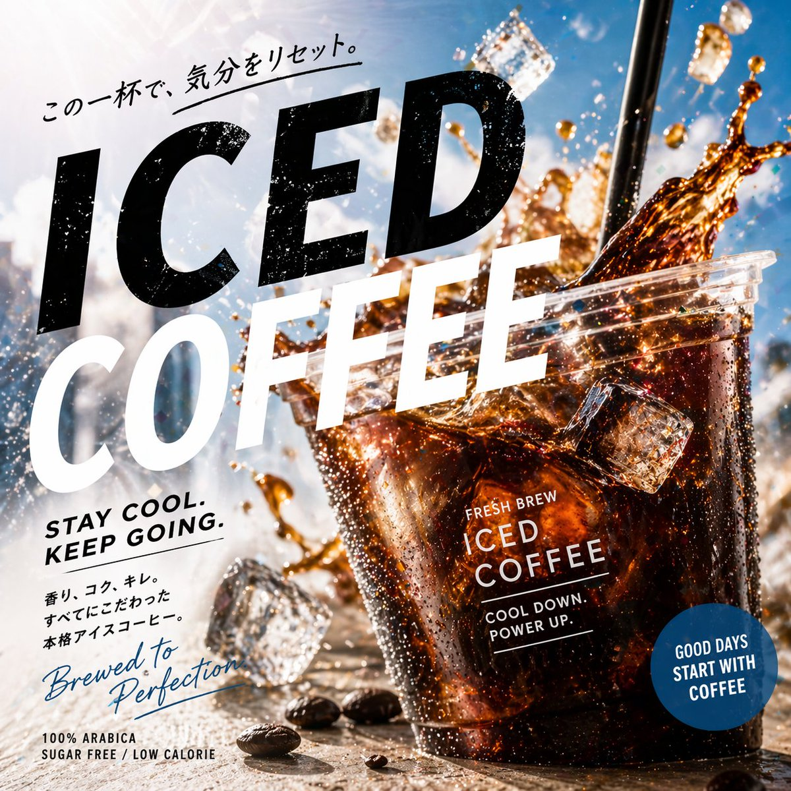</a></p>

<details>
<summary><b>Prompt</b> — Show full prompt</summary>

```text
Create an ad for iced coffee. A stylish, modern Japanese design. Dynamically laid out with Latin fonts. Targeted at 10s-30s. Aspect ratio 1:1.
```

</details>

[📖 View on Tosea](https://tosea.ai/prompts/gpt-image-2#47-create-an-ad-for)

---

### 59. Create a hyper-realistic Japanese-style futuristic product adve…

*by [**Marcio Lima 利真 マルシオ 💎**](https://t.co/MIGv7iv2OZ)*

<a id="59-create-a-hyper-realistic"></a>
<p align="center"><a href="images/59.jpg">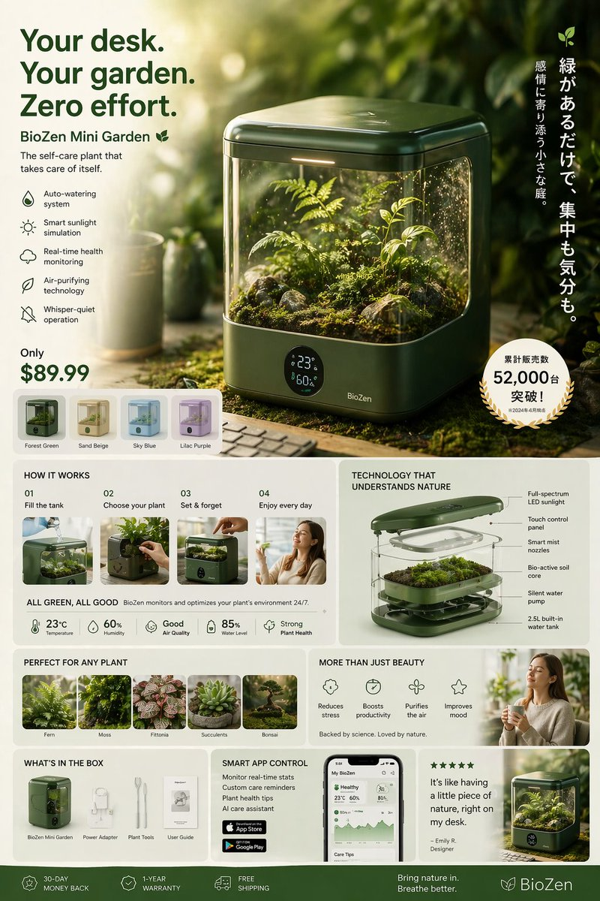</a></p>

<details>
<summary><b>Prompt</b> — Show full prompt</summary>

```text
Create a hyper-realistic Japanese-style futuristic product advertisement, insanely detailed with rich micro-details, cinematic lighting, ultra-clean premium layout, minimalist high-end design aesthetics.
```

</details>

[📖 View on Tosea](https://tosea.ai/prompts/gpt-image-2#59-create-a-hyper-realistic)

---

## Comic & Illustration

### 05. Please create a vibrant, child-like crayon-style vertical (9:16)

*by [**宝玉**](https://t.co/YNuFVnJopP)*

<a id="05-please-create-a-vibrant"></a>
<p align="center"><a href="images/05.jpg"></a></p>

<details>
<summary><b>Prompt</b> — Show full prompt</summary>

```text
Please create a vibrant, child-like crayon-style vertical (9:16) illustration titled “{City Name} Travel Journal.” The artwork should look as if it were drawn by a curious child using colorful crayons, featuring a soft, warm light-toned background (such as pale yellow), combined with bright reds, blues, greens, and other cheerful colors to create a cozy, playful travel atmosphere. I. Main Scene: Travel-Journal Style Route Map In the center of the illustration, draw a “winding, zigzagging travel route” with arrows and dotted lines connecting multiple locations. The route should automatically generate recommended attractions based on {Number of Days}: Example structure (auto-filled with {City Name}-related content): - “Stop 1: {Attraction 1 + short fun description}” - “Stop 2: {Attraction 2 + short fun description}” - “Stop 3: {Attraction 3 + short fun description}” - … - “Final Stop: {Local signature food or souvenir + warm closing remark}” Rules: - If no number of days is provided, default to a 1-day highlight itinerary. II. Surrounding Playful Elements (Auto-adapt to the City) Add many cute doodles and child-like decorative elements around the route, such as: 1. Adorable travel characters - A child holding a local snack - A little adventurer with a backpack 2. Q-style hand-drawn iconic landmarks - “{City Landmark 1}” - “{City Landmark 2}” - “{City Landmark 3}” 3. Funny signboards - “Don’t get lost!” - “Crowds ahead!” - “Yummy food this way!” (Auto-adjust contextually for the city) 4. Sticker-style short phrases - “{City Name} travel memories unlocked!” - “{City Name} food adventure!” - “Where to next?” 5. Cute icons of local foods - “{Local Food 1}” - “{Local Food 2}” - “{Local Food 3}” 6. Childlike exclamations - “I didn’t know {City Name} was so fun!” - “I want to come again!” III. Overall Art Style Requirements - Crayon / children’s hand-drawn travel diary style - Bright, warm, colorful palette - Cozy but full and lively composition - Emphasize the joy of exploring - All text should be in a cute handwritten font - Make the entire page feel like a young child’s fun travel-journal entry --- Input : Chicago 7-Day Trip, English
```

</details>

[📖 View on Tosea](https://tosea.ai/prompts/gpt-image-2#05-please-create-a-vibrant)

---

### 12. Highly detailed, hand-drawn crowded search-and-find illustratio…

*by [**Kris Kashtanova**](https://t.co/DkZT0KeTC5)*

<a id="12-highly-detailed-hand-drawn"></a>
<p align="center"><a href="images/12.jpg">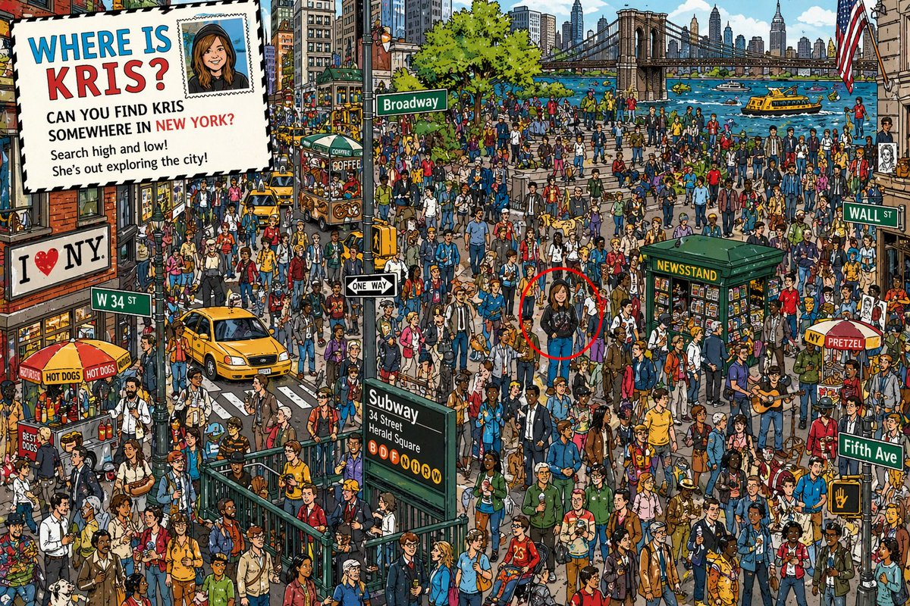</a></p>

<details>
<summary><b>Prompt</b> — Show full prompt</summary>

```text
Highly detailed, hand-drawn crowded search-and-find illustration, vertical composition. Scene: [CITY / LOCATION] in a lively, busy moment — [SPECIFIC ENVIRONMENT: street market / park / subway entrance / rooftop / waterfront]. Filled with hundreds of small characters doing unique activities: [LIST 5–10 MICRO-SCENES: street musicians, food vendors, tourists taking photos, dogs, cyclists, performers, etc.]. Include dense environmental storytelling: [OBJECTS: signs, vehicles, architecture details, storefronts, props, textures]. Main goal: hide a specific character ("Kris") naturally within the crowd. Kris description: [APPEARANCE: hair, face vibe] [OUTFIT: hoodie with graphic, colors] [POSE: walking, smiling, looking at camera, etc.] Kris should be: - visible but not obvious - not centered compositionally - similar scale to surrounding characters - blending into the environment Add a playful title panel in the corner: "WHERE IS KRIS?" Subtext: "Can you find Kris in [LOCATION]?" Style: - colorful, dense, highly detailed - clean linework, expressive characters - slightly exaggerated proportions - packed composition with minimal empty space Camera: wide angle, slightly elevated perspective, everything in focus Lighting: bright daylight, cheerful tones No references to existing characters, brands, or copyrighted IP.
```

</details>

[📖 View on Tosea](https://tosea.ai/prompts/gpt-image-2#12-highly-detailed-hand-drawn)

---

### 33. Show me a photo taken of pages 113-114 from the books：Eldritch…

*by [**Ethan Mollick**](https://t.co/tdnnBvZAj2)*

<a id="33-show-me-a-photo"></a>
<p align="center"><a href="images/33.jpg">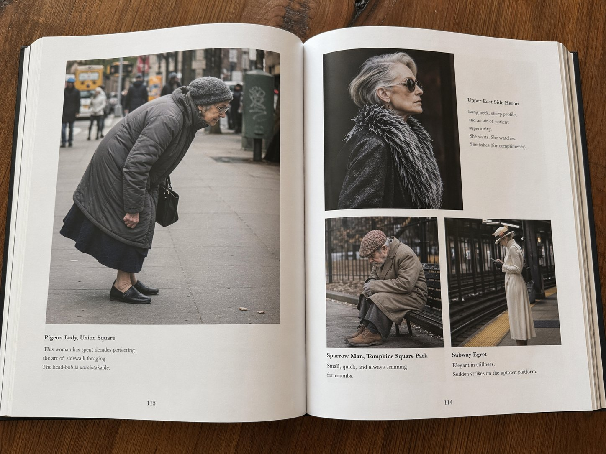</a></p>

<details>
<summary><b>Prompt</b> — Show full prompt</summary>

```text
Show me a photo taken of pages 113-114 from the books：Eldritch Horrors as Pets: A Guide
```

</details>

[📖 View on Tosea](https://tosea.ai/prompts/gpt-image-2#33-show-me-a-photo)

---

### 44. Copy the exact same writing style and continue the text in a hu…

*by [**Ozan Sihay**](https://t.co/h8K8no0wfy)*

<a id="44-copy-the-exact-same"></a>
<p align="center"><a href="images/44.jpg">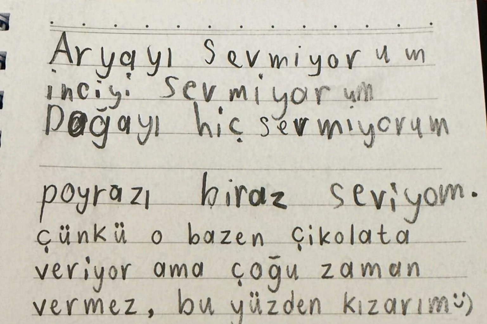</a></p>

<details>
<summary><b>Prompt</b> — Show full prompt</summary>

```text
Copy the exact same writing style and continue the text in a humorous way.
```

</details>

[📖 View on Tosea](https://tosea.ai/prompts/gpt-image-2#44-copy-the-exact-same)

---

### 52. Generate a full color Chinese-text manga about this

*by [**宝玉**](https://t.co/chr7nNcHNS)*

<a id="52-generate-a-full-color"></a>
<p align="center"><a href="images/52.jpg"></a></p>

<details>
<summary><b>Prompt</b> — Show full prompt</summary>

```text
Generate a full color Chinese-text manga about this OpenAI 研究科学家, 陈博远 (first picture), who works on improving the text rendering capability of ChatGPT Image 2 model for the upcoming release. (in the background there is boba tea and a banana taped to the wall with a single slice of duct tape). The model can render insanely small Chinese text when he tried generating some detailed and beautiful multilingual infographics handdrawn-style poster about his hometown, 无锡 on his computer screen. His hard work pays off and the team was impressed by the absurdly good quality of multilingual text performance of his model, seeing all the languages it can write. When he takes a break with one hand holding his phone, he received a translated text message from Sam Altman on his phone (avatar attached as second picture), asking him to take a look at the rendered multilingual text in an image he just generated to congrat the team, since Sam only knows English. However, make it funny by let Boyuan outrage (typical manga style) at the end by seeing Sam's generated image contains a "稳稳地接住你" phrase at the central location in an otherwise perfectly rendered image that's used to congrat the team, because this sentence has been memed as an unnatural but funny Chinese sentence GPT likes to use on Chinese internet. Boyuan should rage "天呐! 它又学会了接住!" (with teammates as tiny heads on the side, sweating and saying in Chinese"we are working hard to fix it！"). At the very bottom of the manga, add a tiny line of footnote (very tiny)in Chinese that "note: the entire manga, including this footnote and picture in picture, are all generated with gpt image 2 at once without editing or multiple steps。" Additional Instructions: Use vertical 1440x2560 image layout, with first row about this researcher working hard, second row about his result on 无锡 with multiple languages, third row shows the team excitement, fourth row split into left and right where left shows he takes a break and the phone received a message, right panel shows Sam's text message, and fifth row shows Sam's picture and 陈博远's reaction. No narration except for the first row. Avoid Chinese map. All characters should be in manga style. The banana background should only appear in the first panel and the tape should be a single slice of tape, not a cross tape. The banana and tape decoration should be small as a insignificant easter egg for people to find. OpenAI logo shall only appear on 陈博远's cloth, not elsewhere. No mugs in the scene since we already have the boba. Sam should only appear in the text message panel. The entire manga should be appear as a professional photo of a physical page in a manga book. In the lower right most corner of the poster there is a small “极小中文也清晰可读：” with a paragraph of much smaller Chinese that begins with “（此处为极小字号测试）无锡是作者的故乡，所以做了这幅海报，中文总算是修好了。很多年没回家了，好想吃大闸蟹啊！” (ultra small).
```

</details>

[📖 View on Tosea](https://tosea.ai/prompts/gpt-image-2#52-generate-a-full-color)

---

## UI & Mockup

### 04. 3D chibi-style miniature concept store of {Brand Name}

*by [**宝玉**](https://t.co/ACdkBfpMwo)*

<a id="04-d-chibi-style-miniature"></a>
<p align="center"><a href="images/04.jpg"></a></p>

<details>
<summary><b>Prompt</b> — Show full prompt</summary>

```text
3D chibi-style miniature concept store of {Brand Name}, creatively designed with an exterior inspired by the brand's most iconic product or packaging (such as a giant {brand's core product, e.g., chicken bucket/hamburger/donut/roast duck}). The store features two floors with large glass windows clearly showcasing the cozy and finely decorated interior: {brand's primary color}-themed decor, warm lighting, and busy staff dressed in outfits matching the brand. Adorable tiny figures stroll or sit along the street, surrounded by benches, street lamps, and potted plants, creating a charming urban scene. Rendered in a miniature cityscape style using Cinema 4D, with a blind-box toy aesthetic, rich in details and realism, and bathed in soft lighting that evokes a relaxing afternoon atmosphere. --ar 2:3 Brand name: Starbucks
```

</details>

[📖 View on Tosea](https://tosea.ai/prompts/gpt-image-2#04-d-chibi-style-miniature)

---

### 06. An ingame screenshot of rust

*by [**Fix**](https://t.co/AvxjuwJnVK)*

<a id="06-an-ingame-screenshot-of"></a>
<p align="center"><a href="images/06.jpg"></a></p>

<details>
<summary><b>Prompt</b> — Show full prompt</summary>

```text
"an ingame screenshot of rust"
```

</details>

[📖 View on Tosea](https://tosea.ai/prompts/gpt-image-2#06-an-ingame-screenshot-of)

---

### 18. Enter a company name or stock ticker to

*by [**宝玉**](https://t.co/6Q0sWISag1)*

<a id="18-enter-a-company-name"></a>
<p align="center"><a href="images/18.jpg"></a></p>

<details>
<summary><b>Prompt</b> — Show full prompt</summary>

```text
Enter a company name or stock ticker to generate an exquisite, miniature isometric 3D scene integrating real-time stock data for the specified date. --- Prompt --- Present an exquisite, miniature 3D cartoon-style scene of the company corresponding to the user-specified company name or stock ticker, clearly viewed from a 45° top-down perspective. Place the company's most iconic building or campus prominently at the center, complemented by proportionally-sized icons of its key products, charming cartoon-style figures, vehicles, and other elements illustrating everyday company activities. The scene should be detailed, finely crafted, and playful. Rendered with Cinema 4D, the modeling should be refined, smoothly rounded, and rich in texture, accurately capturing realistic PBR materials. Gentle, lifelike lighting and soft shadows should create a warm, comfortable ambiance. Creatively integrate the company's real-time stock market data for the user-specified date (or automatically retrieved current date) into the scene, maintaining a clean, minimalist layout and a solid-color background to highlight the primary content. At the top-center of the scene, prominently display the company name or stock ticker in a large font size, followed by the specified date in extra-small font, and the stock price range in a medium-sized font. Include clear, intuitive stock trend icons and charts. All texts should be displayed in the language specified or entered by the user, without any background, and may subtly overlap with the scene elements to enhance overall design integration. Very Important: Before generating, ensure accurate and up-to-date stock market data based on the user-inputted company name or stock ticker and the specified date. If such data is unavailable, notify the user immediately and stop the generation process. Parameters: * Aspect ratio: {User input, default 4:3} * Date: {User input, current date} * Company name or stock ticker: {User input} --- Company Name: Google
```

</details>

[📖 View on Tosea](https://tosea.ai/prompts/gpt-image-2#18-enter-a-company-name)

---

### 20. Please generate me a screenshot of a palintir-style

*by [**Dan Woods**](https://t.co/g3GS6DbrhY)*

<a id="20-please-generate-me-a"></a>
<p align="center"><a href="images/20.jpg">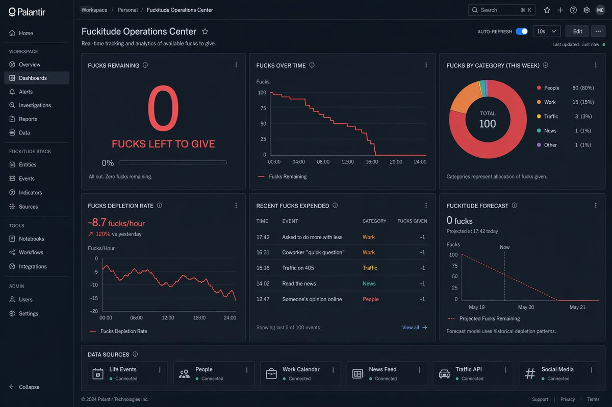</a></p>

<details>
<summary><b>Prompt</b> — Show full prompt</summary>

```text
Please generate me a screenshot of a palintir-style dashboard tracking all the fucks I have left to give
```

</details>

[📖 View on Tosea](https://tosea.ai/prompts/gpt-image-2#20-please-generate-me-a)

---

### 28. Generate a realistic desktop screenshot of Adobe Premiere

*by [**Kate Deyneka**](https://t.co/xOZd6BYsUz)*

<a id="28-generate-a-realistic-desktop"></a>
<p align="center"><a href="images/28.jpg">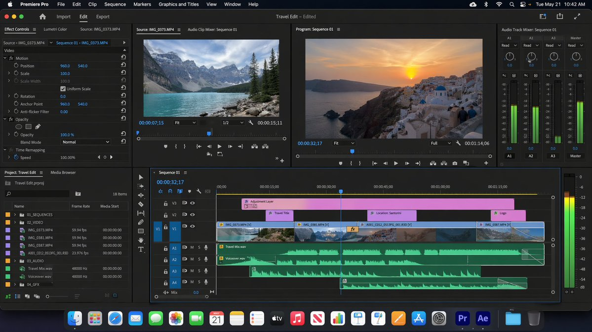</a></p>

<details>
<summary><b>Prompt</b> — Show full prompt</summary>

```text
Generate a realistic desktop screenshot of Adobe Premiere
```

</details>

[📖 View on Tosea](https://tosea.ai/prompts/gpt-image-2#28-generate-a-realistic-desktop)

---

### 57. Miniature Ottoman war, but like the Google Maps live traffic la…

*by [**kazimtaskin**](https://x.com/kazimtaskin/status/2046717867941408923)*

<a id="57-miniature-ottoman-war-but"></a>
<p align="center"><a href="images/57.jpg">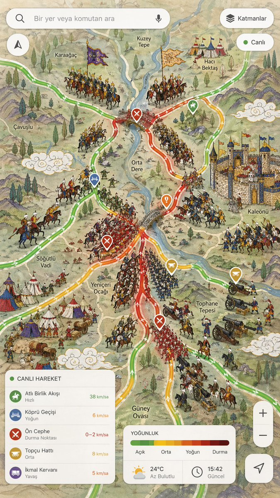</a></p>

<details>
<summary><b>Prompt</b> — Show full prompt</summary>

```text
Miniature Ottoman war, but like the Google Maps live traffic layer
```

</details>

[📖 View on Tosea](https://tosea.ai/prompts/gpt-image-2#57-miniature-ottoman-war-but)

---

## Contributing

We welcome PRs. **Only edit `prompts.json`** — the READMEs are auto-generated by `scripts/build_readmes.py` and will be overwritten on merge. See [CONTRIBUTING.md](CONTRIBUTING.md) for the exact schema.

## License

This collection is released under [CC BY 4.0](LICENSE). Individual prompts remain the intellectual property of their original authors; we only curate, translate, and categorize.

<p align="center"><sub>Curated with care by the team at <a href="https://tosea.ai">Tosea.ai</a> · Auto-generated from <code>prompts.json</code>.</sub></p>
